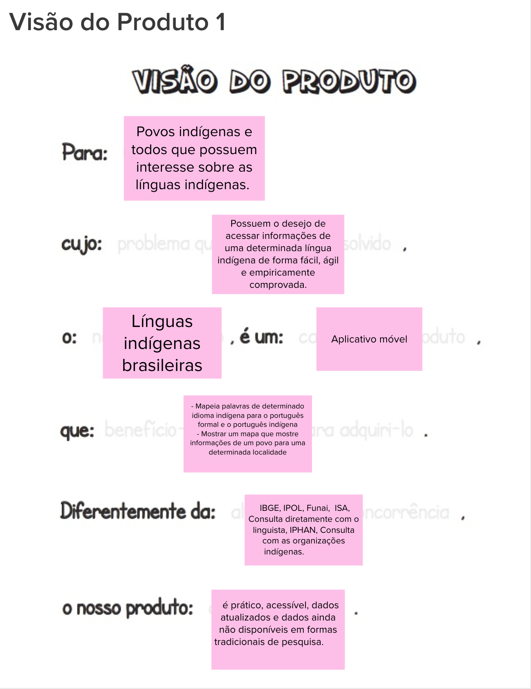
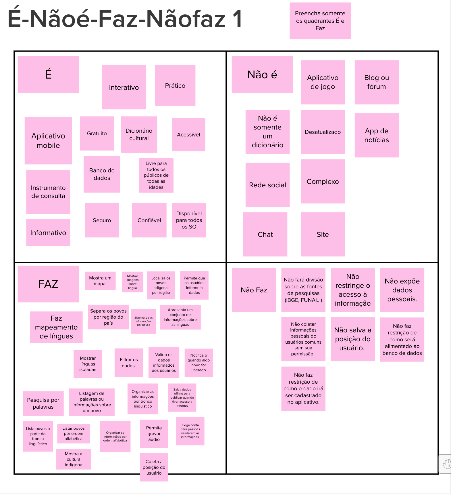
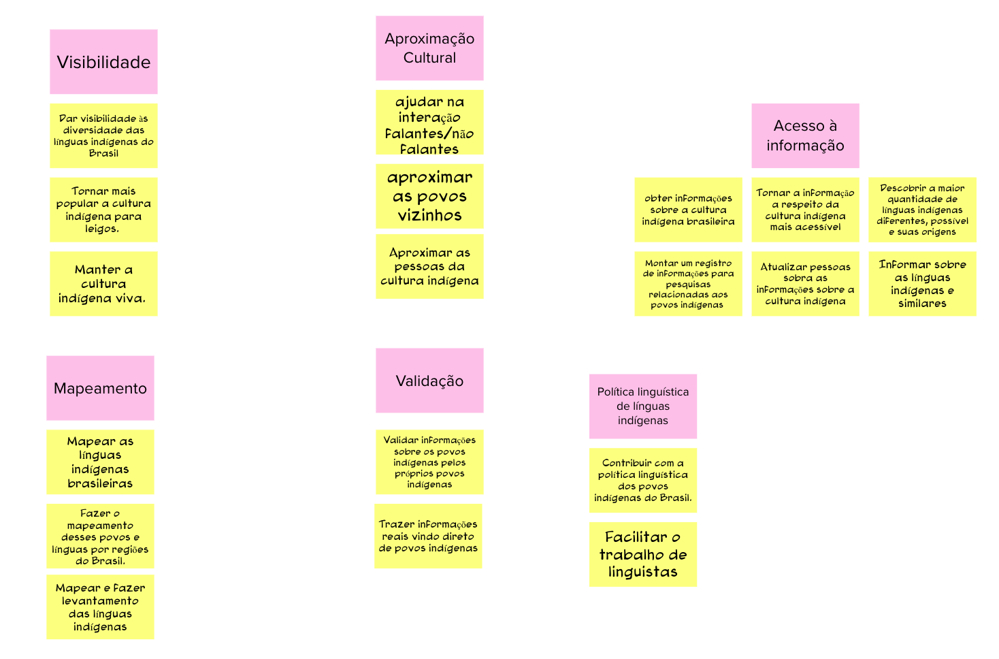

# Dia 1 - Lean Inception 

Lean Inception é o nome dado ao workshop colaborativo para alinhar um grupo de pessoas sobre o produto mínimo viável a ser construído. Ele é feito durante uma semana, em quatro dias, contendo diversas atividades relacionadas ao produto. O primeiro dia é voltado para o entendimento do produto que será desenvolvido.

## Participantes
**Data da Reunião: 6/08/2021**

| Grupo | Nome |
|-------|------|
| PO | Anari, Sâmela, Altaci |
| EPS | Gabriel Davi, Micaella Gouveia, Pedro Igor, Sofia Patrocínio |
| MDS | Ingrid Carvalho, Isadora Galvão, Hérick Lima, Carlos Rafael, Helder Lourenço|

## Como foi realizado
Em uma chamada de vídeo, o início da semana da Lean Inception se deu com um Kick off no qual foi apresentado o conceito da Lean Inception e a agenda da Lean Inception para os demais participantes. O primeiro dia de dinâmicas foi guiado pelo aluno Gabriel Davi, que explicou cada etapa para todos presentes. As atividades foram feitas com a ferramenta [Mural](https://www.mural.co), que é uma plataforma interativa, em que todos os participantes tiveram acesso. Seu principal objetivo é trazer dinamismo e dar a oportunidade de todos conseguirem fazer a atividade.

Inicialmente, o grupo encontrou diversos desafios. O primeiro foi a falta de familiaridade do cliente com a plataforma mural. Para isso, ficou acordado que inicialmente somente o facilitador da semana da Lean iria inserir os itens no mural. Outro desafio foi a incapacidade de divisão de salas pelas plataformas gratuitas de video conferência para que fossem formados grupos em cada atividade, como sugere o livro "Lean Inception". Sendo assim, foi acordado que todas as dinâmicas seriam realizadas em conjunto com todos os participantes na mesma sala. 

Foram realizadas três atividades: **Visão do Produto**, **Produto É - NÃO É - FAZ - NÃO FAZ** e **Objetivos do produto**.

## Visão do Produto
A visão do produto ajuda a trilhar um caminho inicial de ideias que irá levar à criação de um MVP. Ela consiste em trazer uma mensagem clara do que irá transmitir a essência do produto. 

Nessa primeira dinâmica, notou-se a perda de foco constante sobre a atividade. Isso gerou um atraso considerável que consumiu um tempo rasoável destinado ao primeiro dia. Devido a isso, foi gerado somente um documento relativo à visão do produto. 

### **Resultados**

## Produto É - NÃO É - FAZ - NÃO FAZ 
Uma das maneiras de entender um produto por diversas vezes é descrevendo o que ele não é ou não faz. Sendo assim, além de descrever as caracteriscas de um dado produto e seu comportamento, essa atividade propõe o caminho inverso e com isso deixamos explícito todas as categorias as quais o produto **não** faz parte e todos os comportamentos que ele **não** contemplará. 

A partir desse momento, foi intensificado o uso do parking lot para que fosse evitado as discussões não relativas à dinâmica. Com isso, temos o seguinte resultado. 

### **Resultados**

## Objetivos do Produto
O após as dinâmicas anteriores, cada participante já possui algum entendimento do produto. Com isso, essa dinâmica consiste em cada um compartilhar o que entendeu ser os objetivos do mesmo. Em seguida, após escritos, todos os itens levantados são separados em categorias semelhantes. 

As categorias levantadas foram "Visibilidade", "Aproximação Cultural", "Acesso à informação", "Mapeamento", "Validação" e por fim "Política linguística de línguas indígenas". Cada objetivo pode ser analisado a seguir: 

### **Resultados**

## Referências
* MURAL. Disponível em: [https://www.mural.co](https://www.mural.co). Último acesso em 16/08/2021.
* Lean Inception: Como Alinhar Pessoas e Construir o Produto Certo - Paulo Caroli.