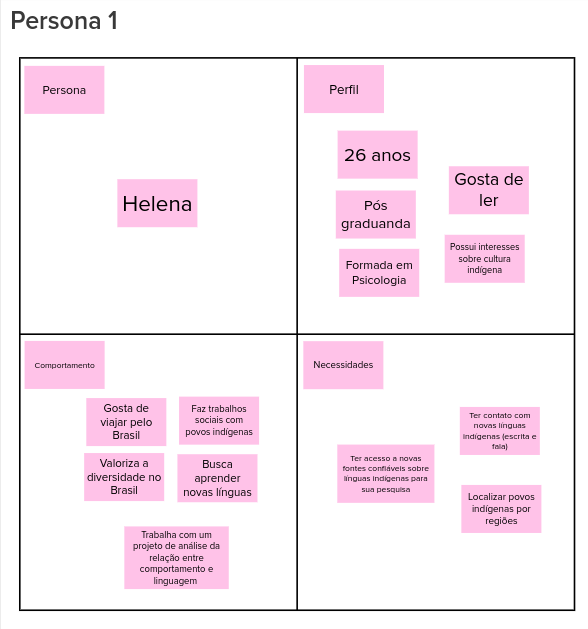
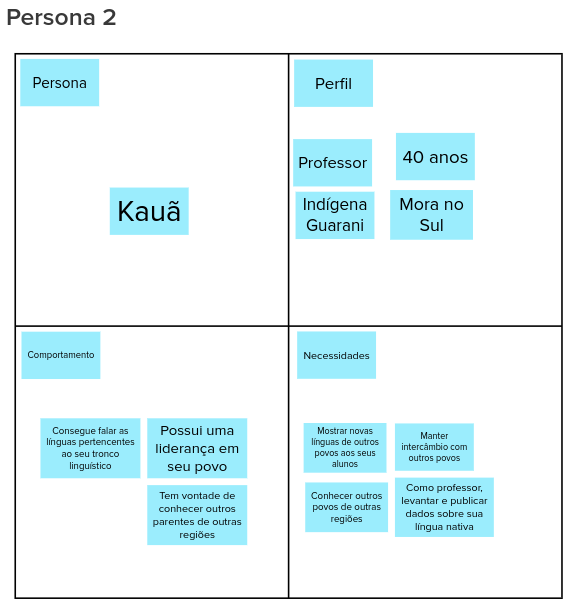
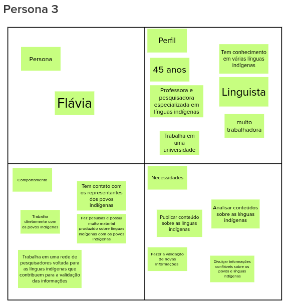
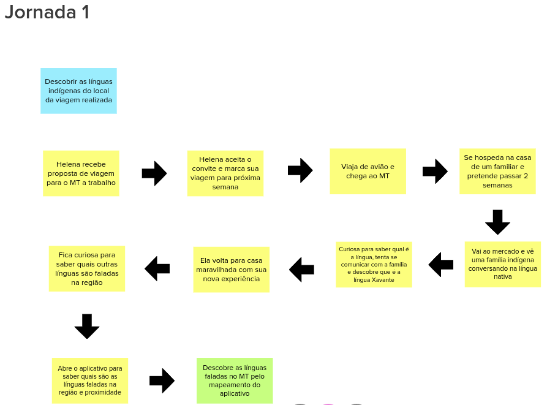
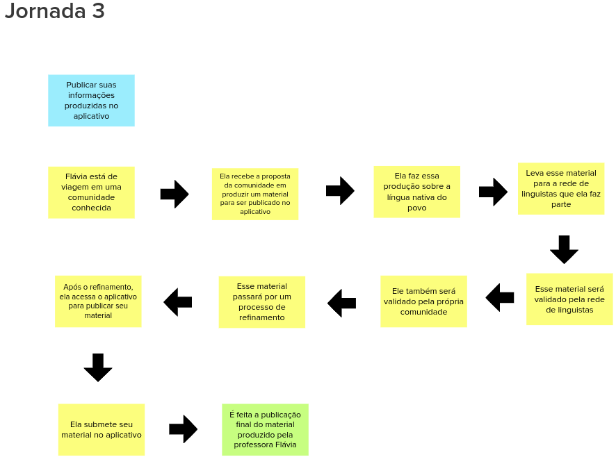

# Dia 2 - Lean Inception 

Lean Inception é o nome dado ao workshop colaborativo para alinhar um grupo de pessoas sobre o produto mínimo viável a ser construído. Ele é feito durante uma semana, em quatro dias, contendo diversas atividades relacionadas ao produto. O segundo dia é voltado para os usuários da aplicação.

## Participantes
**Data da Reunião: 11/08/2021**

| Grupo | Nome |
|-------|------|
| PO | Anari, Sâmela |
| EPS | Gabriel Davi, Micaella Gouveia, Pedro Igor, Sofia Patrocínio |
| MDS | Ingrid Carvalho, Isadora Galvão, Hérick Lima, Carlos Rafael, Helder Lourenço|

## Como foi realizado
Foi feita uma chamada online com todos os participantes. A aluna Micaella ficou responsável em apresentar e explicar as atividades que seriam realizadas. As atividades foram feitas com a ferramenta [Mural](https://www.mural.co), que é uma plataforma interativa, em que todos os participantes tiveram acesso. Seu principal objetivo é trazer dinamismo e dar a oportunidade de todos conseguirem fazer a atividade.

Foram realizadas duas atividades: **Personas** e **Jornadas de Usuário**.

## Personas
Para efetivamente identificar as funcionalidades de um produto, é importante ter em mente os usuários e seus objetivos. Uma persona cria uma representação realista de usuários, auxiliando o time a descrever funcionalidades do ponto de vista de quem vai interagir com o produto final.

Foram criadas três personas, cada uma representando um conjunto de possíveis usuários da aplicação. A primeira persona representa uma pessoa interessada no conteúdo do aplicativo, a segunda representa um indígena que utilizará o aplicativo, e a terceira representa uma professora que publicará informações no aplicativo.

### **Resultados**

## Jornadas de Usuário
A jornada descreve o percurso de um usuário por uma sequência de passos para alcançar um objetivo. Alguns desses passos representam diferentes pontos de contato com o produto, caracterizando a interação da pessoa com ele.

Foram criadas três jornadas de usuários, cada uma representada por uma persona criada anteriormente.

### **Resultados**

## Referências
* MURAL. Disponível em: [https://www.mural.co](https://www.mural.co). Último acesso em 14/08/2021.
* Lean Inception: Como Alinhar Pessoas e Construir o Produto Certo - Paulo Caroli.