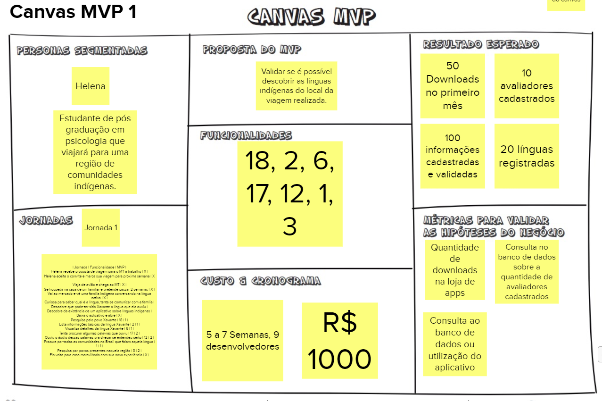
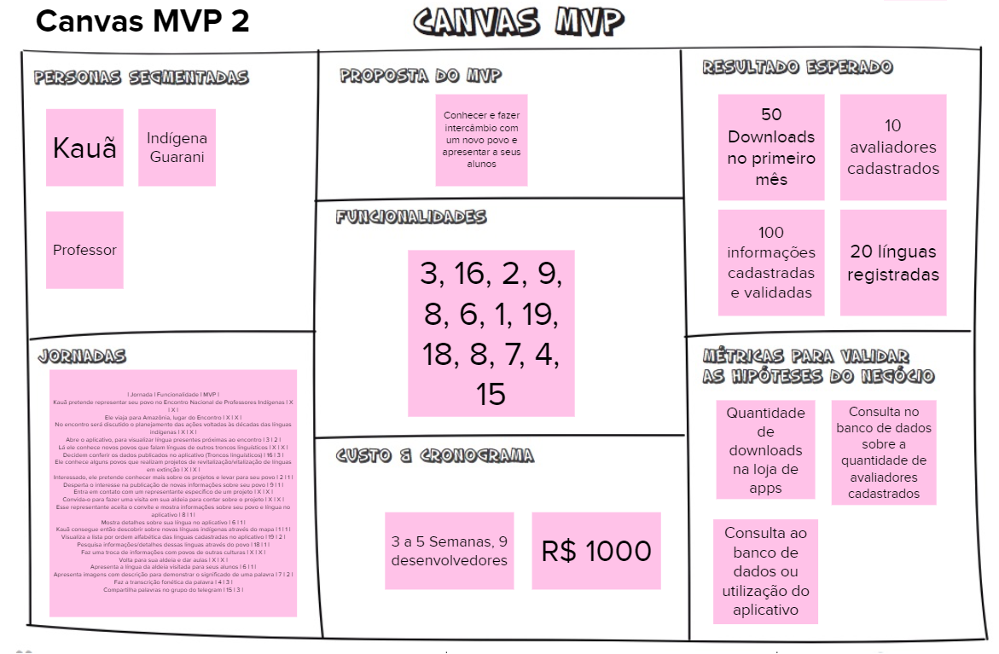
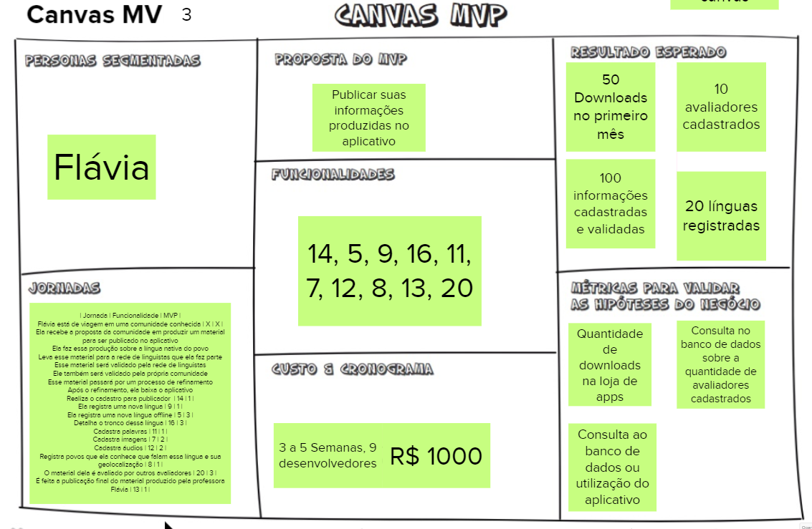
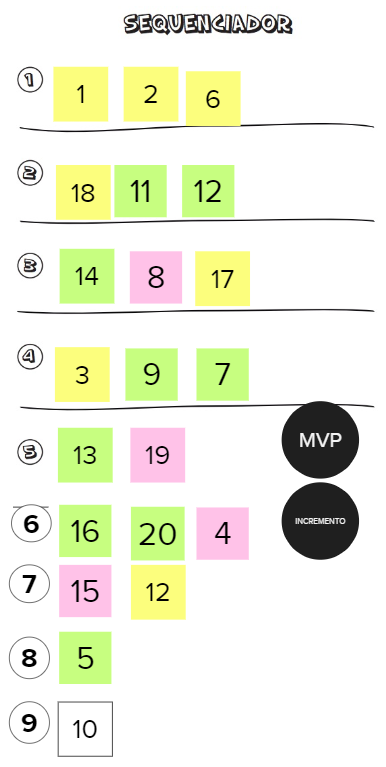

# Dia 4 - Lean Inception 

Lean Inception é o nome dado ao workshop colaborativo para alinhar um grupo de pessoas sobre o produto mínimo viável a ser construído. Ele é feito durante uma semana, em quatro dias, contendo diversas atividades relacionadas ao produto. O segundo dia é voltado para os usuários da aplicação.

## Participantes
**Data da Reunião: 14/08/2021**

| Grupo | Nome |
|-------|------|
| EPS | Gabriel Davi, Micaella Gouveia, Pedro Igor, Sofia Patrocínio |
| MDS | Ingrid Carvalho, Isadora Galvão, Hérick Lima, Carlos Rafael, Helder Lourenço|

## Como foi realizado
Foi feita uma chamada online com todos os participantes. O aluno Pedro Igor ficou responsável em apresentar e explicar as atividades que seriam realizadas. As atividades foram feitas com a ferramenta [Mural](https://www.mural.co), que é uma plataforma interativa, em que todos os participantes tiveram acesso. Seu principal objetivo é trazer dinamismo e dar a oportunidade de todos conseguirem fazer a atividade.

Foram realizadas duas atividades: **Canvas MVP** e **Sequenciador**.

## Canvas MVP
Para construir o Canvas MVP (Minimum Viable Product) foram criadas jornadas de usuário, uma pra cada persona, com o objetivo de identificar as funcionalidades essenciais para cada persona. Após selecionar as funcionalidades de cada Canvas foi então realizada um levantamento de custo para aquele MVP além de resultados esperados e métricas que seriam utilizadas para avaliação dos resultados.

### Canvas MVP 1
#### Proposta
Validar se é possível descobrir as línguas indígenas do local da viagem realizada.
#### Persona
Helena, estudante de pós graduação em psicologia que viajará para uma região de comunidades indígenas.
#### Jornada
A numeração das funcionalidades foi baseada nas funcionalides descritas no [Terceiro dia do Lean](dia3.md).
| Jornada | Funcionalidade | MVP |
| ------- | -------------- | --- |
| Helena recebe proposta de viagem para o MT a trabalho | X | X |
| Helena aceita o convite e marca sua viagem para próxima semana | X | X |
| Viaja de avião e chega ao MT | X | X |
| Se hospeda na casa de um familiar e pretende passar 2 semanas | X | X |
| Vai ao mercado e vê uma família indígena conversando na língua nativa | X | X |
| Curiosa para saber qual é a língua, tenta se comunicar com a família | X | X |
| Descobre que pode ter sido Xavante a língua que ela ouviu | X | X |
| Descobre da existência de um aplicativo sobre línguas indígenas | X | X |
| Baixa o aplicativo e abre | X | X |
| Pesquisa pelo povo Xavante | 18 | 1 |
| Lista informações básicas da língua Xavante | 2 | 1 |
| Visualiza detalhes da língua Xavante | 6 | 1 |
| Tenta procurar algumas palavras que ouviu | 17 | 2 |
| Ouviu o áudio dessas palavras pra checar se entendeu certo | 12 | 2 |
| Procura por todas as comunidades no Brasil que falam aquela língua | 1 | 1 |
| Pesquisa por povos presentes naquela região | 3 | 2 |
| Ela volta para casa maravilhada com sua nova experiência | X | X |

#### Custo e Cronograma
5 a 7 semanas, 9 desenvolvedores. R$ 1000,00

#### Resultado Esperado
- 50 Downloads no primeiro mês
- 10 avaliadores cadastrados
- 100 informações cadastradas e validadas
- 20 línguas registradas

#### Métricas para validação dos resultados
- Quantidade de downloads na loja de apps
- Consulta no banco de dados sobre a quantidade de avaliadores cadastrados
- Consulta ao banco de dados ou utilização do aplicativo

### Canvas MVP 2
#### Proposta
Conhecer e fazer intercâmbio com um novo povo e apresentar a seus alunos.
#### Persona
Kauã, Professor Indígena do povo Guarani.
#### Jornada
A numeração das funcionalidades foi baseada nas funcionalides descritas no [Terceiro dia do Lean](dia3.md).
| Jornada | Funcionalidade | MVP |
| ------- | -------------- | --- |
| Kauã pretende representar seu povo no Encontro Nacional de Professores Indígenas | X | X |
| Ele viaja para Amazônia, lugar do Encontro | X | X |
| No encontro será discutido o planejamento das ações voltadas às décadas das línguas indígenas | X | X |
| Abre o aplicativo, para visualizar língua presentes próximas ao encontro | 3 | 2 |
| Lá ele conhece novos povos que falam línguas de outros troncos linguísticos | X | X |
| Decidem conferir os dados publicados no aplicativo (Troncos linguísticos) | 16 | 3 |
| Ele conhece alguns povos que realizam projetos de revitalização/vitalização de línguas em extinção | X | X |
| Interessado, ele pretende conhecer mais sobre os projetos e levar para seu povo | 2 | 1 |
| Desperta o interesse na publicação de novas informações sobre seu povo | 9 | 1 |
| Entra em contato com um representante específico de um projeto | X | X |
| Convida-o para fazer uma visita em sua aldeia para contar sobre o projeto | X | X |
| Esse representante aceita o convite e mostra informações sobre seu povo e língua no aplicativo | 8 | 1 |
| Mostra detalhes sobre sua língua no aplicativo | 6 | 1 |
| Kauã consegue então descobrir sobre novas línguas indígenas através do mapa | 1 | 1 |
| Visualiza a lista por ordem alfabética das linguas cadastradas no aplicativo | 19 | 2 |
| Pesquisa informações/detalhes dessas linguas através do povo | 18 | 1 |
| Faz uma troca de informações com povos de outras culturas | X | X |
| Volta para sua aldeia e dar aulas | X | X |
| Apresenta a língua da aldeia visitada para seus alunos | 6 | 1 |
| Apresenta imagens com descrição para demonstrar o significado de uma palavra | 7 | 2 |
| Faz a transcrição fonética da palavra | 4 | 3 |
| Compartilha palavras no grupo do telegram | 15 | 3 |
#### Custo e Cronograma
3 a 5 semanas, 9 desenvolvedores. R$ 1000,00

#### Resultado Esperado
- 50 Downloads no primeiro mês
- 10 avaliadores cadastrados
- 100 informações cadastradas e validadas
- 20 línguas registradas

#### Métricas para validação dos resultados
- Quantidade de downloads na loja de apps
- Consulta no banco de dados sobre a quantidade de avaliadores cadastrados
- Consulta ao banco de dados ou utilização do aplicativo

### Canvas MVP 3
#### Proposta
Publicar informações produzidas no aplicativo.
#### Persona
Flávia, linguista, professora e pesquisadora especializada em línguas indígenas.
#### Jornada
A numeração das funcionalidades foi baseada nas funcionalides descritas no [Terceiro dia do Lean](dia3.md).
| Jornada | Funcionalidade | MVP |
| ------- | -------------- | --- |
| Flávia está de viagem em uma comunidade conhecida | X | X |
| Ela recebe a proposta da comunidade em produzir um material para ser publicado no aplicativo | X | X | 
| Ela faz essa produção sobre a língua nativa do povo | X | X | 
| Leva esse material para a rede de linguistas que ela faz parte | X | X | 
| Esse material será validado pela rede de linguistas | X | X | 
| Ele também será validado pela própria comunidade | X | X | 
| Esse material passará por um processo de refinamento | X | X | 
| Após o refinamento, ela baixa o aplicativo | X | X |
| Realiza o cadastro para publicador | 14 | 1 |
| Ela registra uma nova língua | 9 | 1 |
| Ela registra uma nova língua offline | 5 | 3 |
| Detalha o tronco dessa língua | 16 | 3 |
| Cadastra palavras | 11 | 1 |
| Cadastra imagens | 7 | 2 |
| Cadastra áudios | 12 | 2 |
| Registra povos que ela conhece que falam essa língua e sua geolocalização | 8 | 1 |
| O material dela é avaliado por outros avaliadores | 20 | 3 |
| É feita a publicação final do material produzido pela professora Flávia | 13 | 1 |
#### Custo e Cronograma
3 a 5 semanas, 9 desenvolvedores. R$ 1000,00

#### Resultado Esperado
- 50 Downloads no primeiro mês
- 10 avaliadores cadastrados
- 100 informações cadastradas e validadas
- 20 línguas registradas

#### Métricas para validação dos resultados
- Quantidade de downloads na loja de apps
- Consulta no banco de dados sobre a quantidade de avaliadores cadastrados
- Consulta ao banco de dados ou utilização do aplicativo

## Sequenciador
A partir dos mvps produzidos e suas respectivas funcionalides foi criado um sequenciador com o objetivo de listar funcionalidades que deveriam estar presentes nas primeiras versões da aplicação. A numeração das funcionalidades foi baseada nas funcionalides descritas no [Terceiro dia do Lean](dia3.md). A cor de cada um dos post-its fazem referência ao Canvas MVP correspondente.

## Referências
* MURAL. Disponível em: [https://www.mural.co](https://www.mural.co). Último acesso em 14/08/2021.
* Lean Inception: Como Alinhar Pessoas e Construir o Produto Certo - Paulo Caroli.