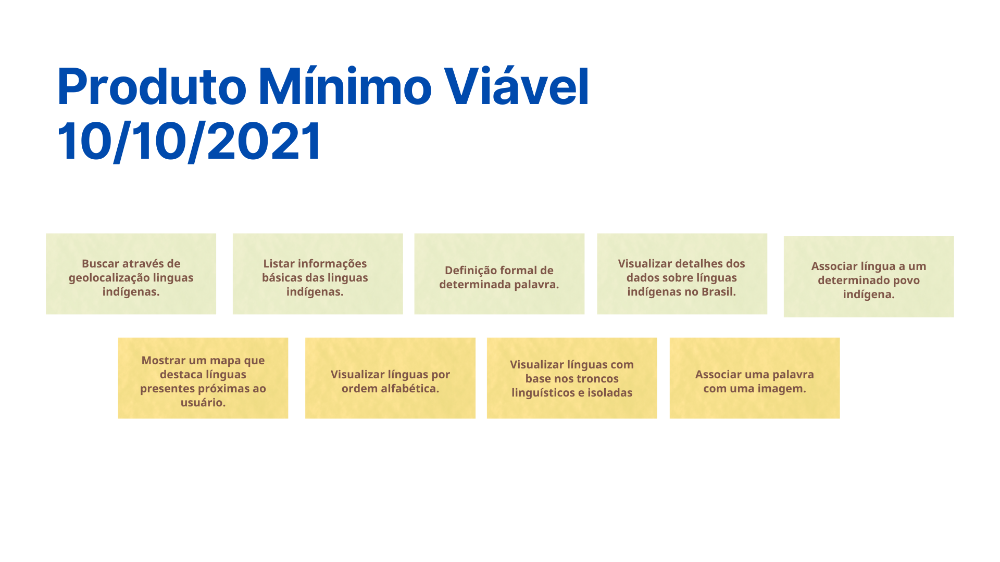
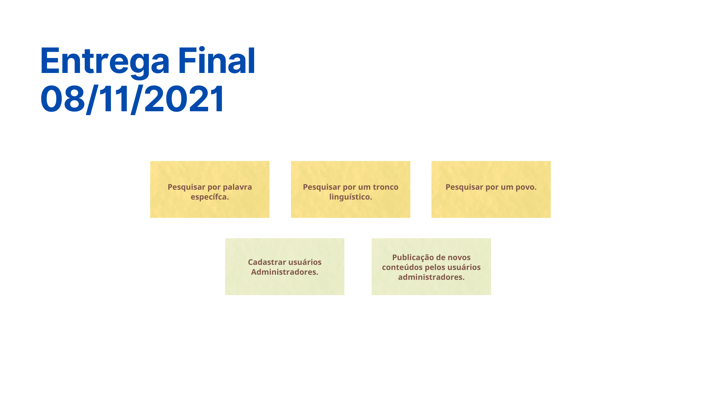

# MVP - Minimum Viable Product

Após realização da Lean Inception e aplicação do sequenciador, foi possível priorizar funcionalidades que estarão presentes nas diferentes versões da aplicação. Consideramos no MVP as funcionalidades presentes até a iteração 2 do sequenciador e, a fim de validar as informações levantadas durante toda a Lean Inception, foi realizada uma apresentação resumindo os dados levantados e dúvidas relativas a prioridade de funcionalidades. Parte do nosso time de cliente não pôde estar presente durante a apresentação e por isso decidimos gravá-la e disponibilizar no nosso canal de comunicação para poderem assistir de forma assíncrona e finalizarmos a decisão sobre do MVP na segunda-feira, dia 30/08. 

## Participantes
**Data da Reunião: 21/08/2021**

| Grupo | Nome |
|-------|------|
| PO | Sâmela, Eunice |
| Professor | Hilmer Rodrigues |
| EPS | Gabriel Davi, Micaella Gouveia, Pedro Igor, Sofia Patrocínio |
| MDS | Ingrid Carvalho, Hérick Lima, Carlos Rafael, Helder Lourenço |

## MVP
Com as atualizações do escopo do projeto, o MVP foi alterado para melhor atender as necessidades das clientes com o tempo de projeto. Segue abaixo o MVP que será entregue dia 10/10/2021.

## Entrega Final
Com as atualizações do escopo do projeto, a entrega final foi alterada para melhor atender as necessidades das clientes com o tempo de projeto. Segue abaixo as funcionalidades que serão acrescentadas ao produto para a entrega final, com data marcada para o dia 08/11/2021.

## Apresentação

  <iframe loading="lazy" style="position: absolute; width: 100%; height: 100%; top: 0; left: 0; border: none; padding: 0;margin: 0;"
    src="https:&#x2F;&#x2F;www.canva.com&#x2F;design&#x2F;DAEnm_732Sc&#x2F;view?embed">
  </iframe>

<a href="https:&#x2F;&#x2F;www.canva.com&#x2F;design&#x2F;DAEnm_732Sc&#x2F;view?utm_content=DAEnm_732Sc&amp;utm_campaign=designshare&amp;utm_medium=embeds&amp;utm_source=link" target="_blank" rel="noopener">Línguas Indígenas</a> by Sofia Patrocínio

## Vídeo
<iframe allowFullScreen="allowFullScreen" src="https://www.youtube.com/embed/xGOfX3NWh5o?ecver=1&amp;iv_load_policy=3&amp;rel=0&amp;showinfo=0&amp;yt:stretch=16:9&amp;autohide=1&amp;color=red&amp;width=560&amp;width=560" width="560" height="315" allowtransparency="true" frameborder="0">
<a  id="RlpVqn7U" href="https://downloadyou.tube">at this website</a>

<a  id="RlpVqn7U" href="https://downloadyou.tube/">DLYouTube</a>
<small>Powered by <a href="https://youtubevideoembed.com/ ">Embed YouTube Video</a></small></iframe>

## Resultado

Na próxima reunião, dia 30/08, serão esclarecidas algumas dúvidas:
- Funcionalidade de publicar/validar novos conteúdos (de pessoas que não são membros da equipe, ou que ainda não estão validados), além do cadastro de novos administradores fará parte do MVP ou será entregue em outra iteração.
- Decisão nome do aplicativo