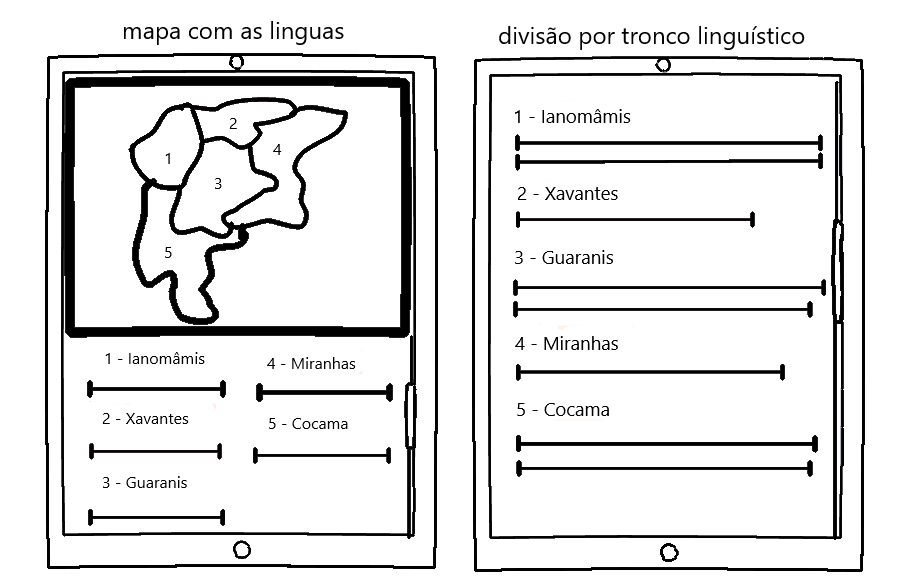
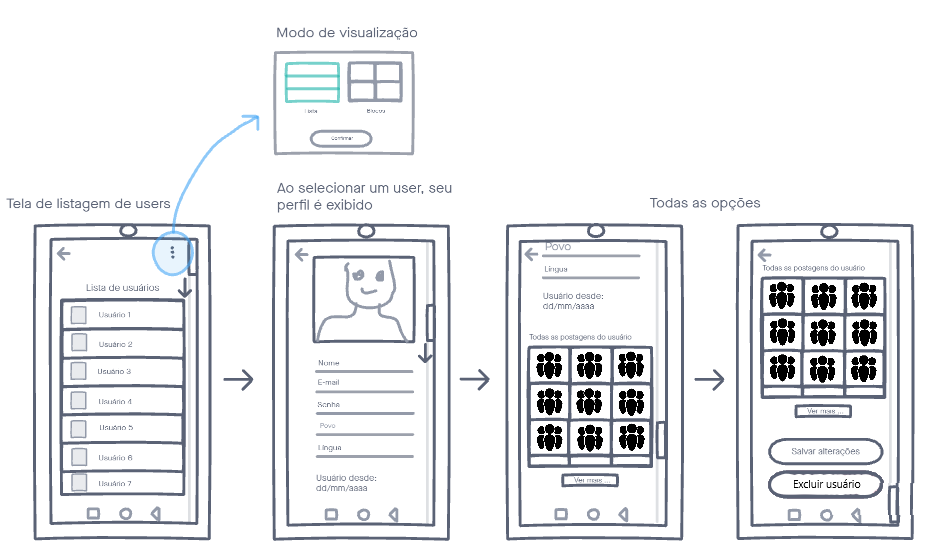
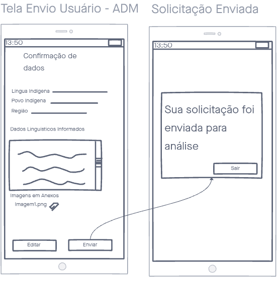
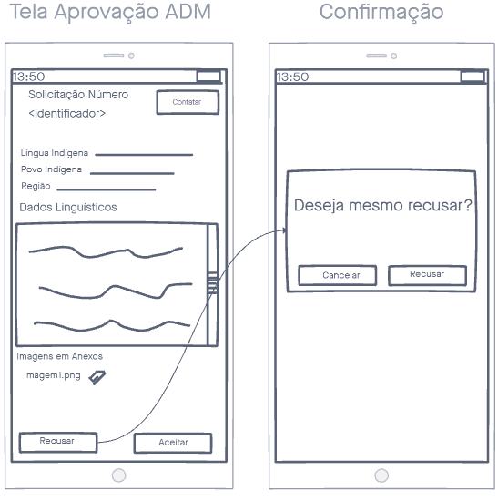
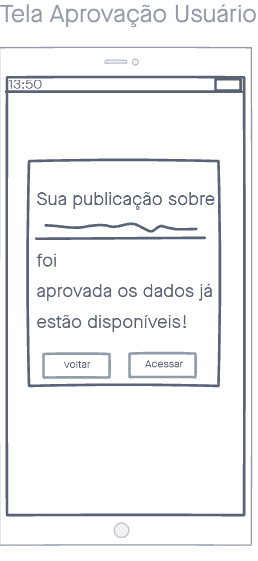
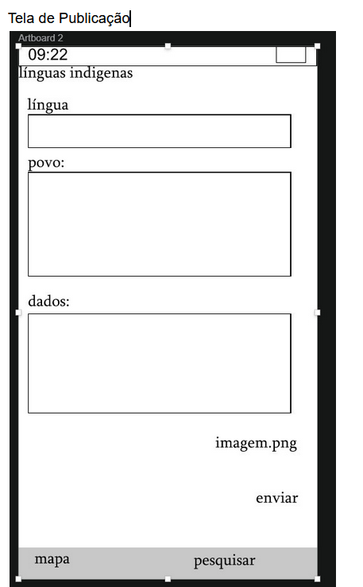

# Protótipo de Baixa Fidelidade

Os protótipos de baixa fidelidade são protótipos desenhados no papel. Eles visam definir a interação do usuário com a aplicação de forma simples, sem preocupações com elementos ligados ao design. Por causa da sua simplicidade, muitas vezes ele é utilizado para ajudar na definição do projeto e no levantamento dos requisitos do produto.

## Metodologia

Para o projeto, cada membro do time ficou responsável em desenvolver uma funcionalidade definida anteriormente. Essa divisão foi feita da seguinte forma:

**1. Usuário Admin**:

Membros Responsáveis: Herick e Helder

- Cadastro admin
- Controle de usuários

**2. Mapeamento**:

Membros Responsáveis: Herick e Helder

- Mapa com as línguas
- Divisão por tronco linguístico (listagem)

**3. Avaliação**:

Membros Responsáveis: Carlos Rafael e Ingrid

- Tela de publicação de novas informações
- Tela de envio para os adms
- Tela de Aprovação do conteúdo (Dados da pessoa que aprovou e enviou)

**4. Língua específica**:

Membros Responsáveis: Carlos Rafael e Ingrid

- Dados da lingua
- Imagens
- Povos que falam a língua

## Protótipos Produzidos

1. Herick e Helder

2. Carlos Rafael e Ingrid

## Discussões de Melhorias

1. Mapa
* Deixar o mapa maior
* Tela separada para os troncos

2. Controle de usuários
* Dados mascarados
* Excluir usuário vai exisitr?

3. Publicação dos dados
* Criar e validar um formulario
* Contatar pessoa que publica sobre alterações que devem ser feitas (revisão)

4. Língua específica
* Barra de pesquisar junto com o mapa
* Área de PESQUISAR seria ADMIN
* Botão de configurações

## Referências

- Fidelidade de [Protótipos](Modeling/objeto?id=protótipo): <https://www.vitaminaweb.com.br/fidelidade-de-prototipos-baixa-media-ou-alta/>. Último acesso em 19/08/2020.