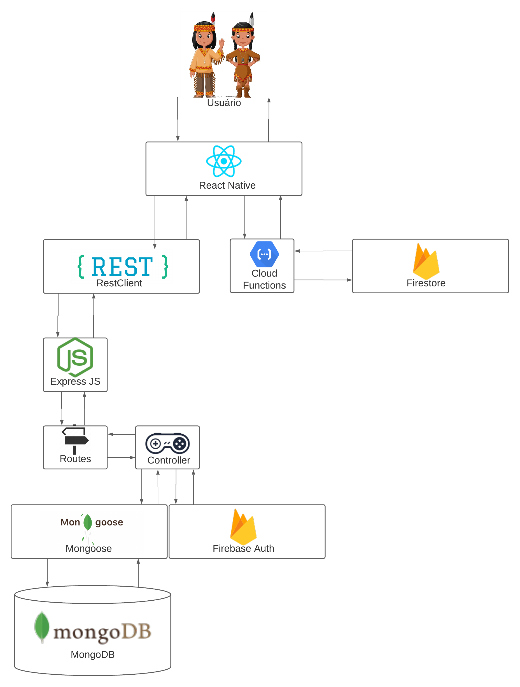
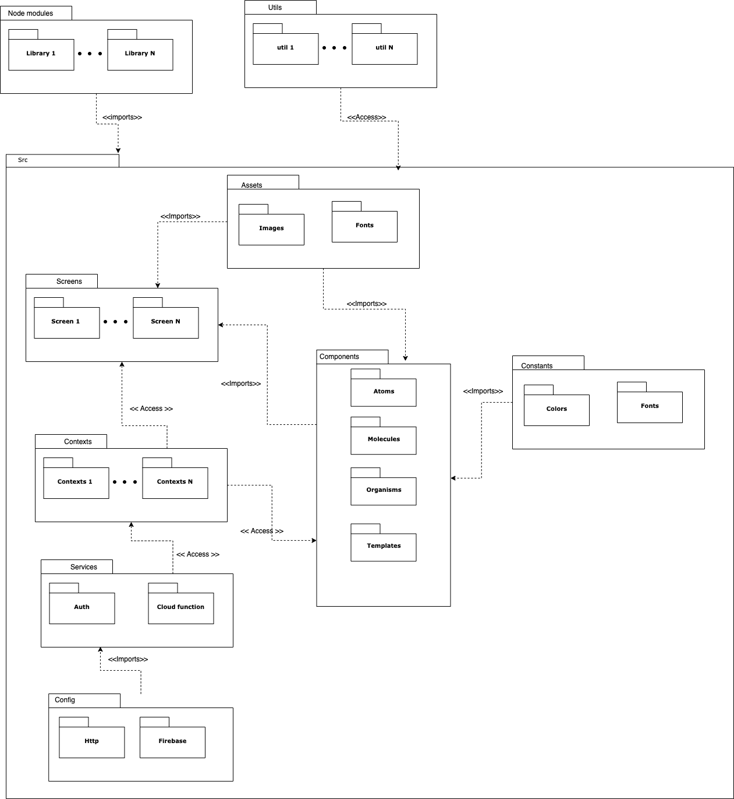
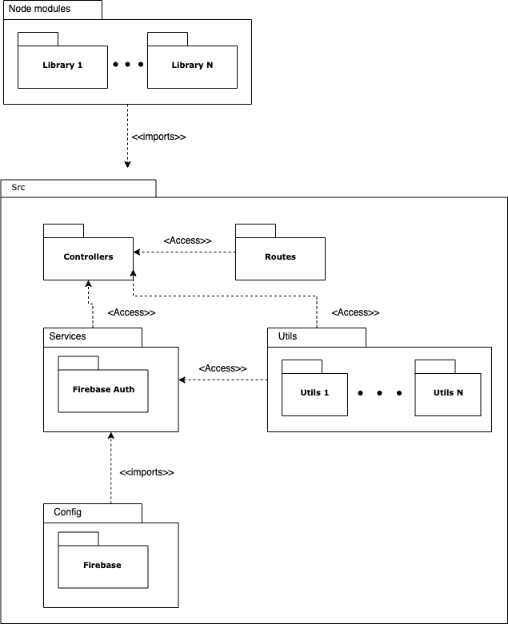
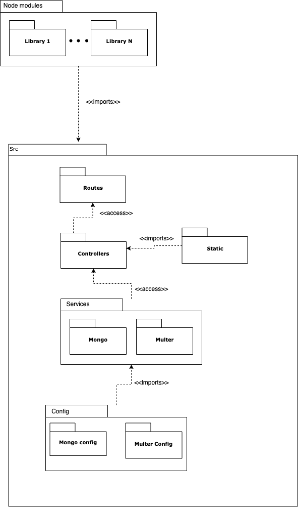

# Documento de Arquitetura de Software

É um documento que descreve as principais características arquiteturais do projeto Línguas Indígenas. Esse documento cobre diferentes visões de implementação que tornou possível o desenvolvimento da aplicação.

## Histórico de Revisão
| Data | Versão | Descrição | Autor |
|------|--------|-----------|-------|
| 25/08/2021 | 1.0 | Abertura do documento | Grupo EPS |
| 25/08/2021 | 1.1 | Adição do Tópico 1 - Finalidade e Tópico 3 - Metas e Restrições de Arquitetura | Micaella Gouveia |
| 28/08/2021 | 1.2 | Adição do Tópico 2 - Tecnologias | Grupo MDS |
| 28/08/2021 | 1.3 | Adição do Diagrama de Contexto | Pedro Igor |
| 29/08/2021 | 1.4 | Adição do Diagrama de Pacotes | Gabriel Davi|

## 1 - Introdução

### 1.1 - Finalidade

Este documento tem como finalidade fornecer uma visão geral da arquitetura do projeto Línguas Indígenas, utilizando-se de diversas visões arquiteturais, como a visão lógica, a fim de facilitar o entendimento dos processos e funcionamento de todo o sistema. Tem também como objetivo transmitir as decisões arquiteturais significativas tomadas em relação ao mesmo.As decisões foram tomadas pelo grupo MDS/EPS e o grupo de clientes liderados pela professora Altaci.

### 1.2 - Escopo

## 2 - Representação Arquitetural

### 2.1 - Tecnologias

### Frontend:

- **React Native**
  É um framework baseado no React, que possibilita o desenvolvimento de aplicações mobile (tanto para Android, quanto para iOS) utilizando a linguagem Javascript. O que diferencia o React Native dos outros frameworks, é que todo o código desenvolvido é convertido para linguagem nativa do sistema operacional, o que acaba tornando o aplicativo muito mais fluido.

### Backend:

- **NodeJS**
  É um Ambiente de execução JavaScript fora do browser. Com flexibilidade, escala e fácil transferência de dados, que faz destacar principalmente a arquitetura de microsserviços, diminuindo custos e perdas causados por alto acoplamento.

### Banco de dados:

- **FireBase**
  Plataforma de gerenciamento de banco de dados, onde é possível armazenar arquivos como vídeos, imagens, áudios etc. Também é possível gerenciar toda a área de login e cadastro de usuários. Acelera o desenvolvimento do App pois ele exclui quase que totalmente a parte de criação e gerenciamento de banco de dados, tornando mais fácil e prático de se desenvolver.

- **Mongodb**
  É um sistema de banco de dados global de nuvens orientado a documentos, multiplataforma e de código aberto, voltado para desenvolvedores de aplicativos modernos.

### Ambiente:

- **Docker**
  É uma plataforma open source que facilita a criação e administração de ambientes isolados. As aplicações são ficam no formato de "containers", incluindo todas as dependências necessárias para executar sua aplicação. Cada container criado atua como uma máquina virtual flexível, isso facilita quando a equipe tiver que migrar, copiar ou implementar ambientes de trabalho.

## 3 - Metas e Restrições de Arquitetura

### 3.1 - Metas

- Usabilidade: Aplicação deve possuir uma interface intuitiva e de fácil acesso para todos os públicos.
- Segurança: A aplicação deve ser segura para seus usuários e dados. Isso quer dizer que qualquer informação sensível do usuário e os dados disponibilizados devem estar em segurança em nossos servidores e nossos servidores devem ser protegidos contra ataques externos.
- Escalabilidade: A aplicação deve ser capaz de crescer junto com a ascensão de novos usuários e também ser escalável para implementação de novas funcionalidades.
- Confiabilidade: A aplicação deve ser capaz de trazer dados confiáveis sobre as línguas indígenas.
- Offline First: A aplicação deve ser capaz de armazenar ações do usuário feitas de forma offline para quando houver acesso à internet, ser realizada.

### 3.2 - Restrições

- Conectividade: É necessário estar conectado com a internet para conseguir publicar novos conteúdos.
- Idioma: A aplicação tem idioma para o português, porém ela abordará sobre outras línguas indígenas.
- Usuários Administradores: Usuários Administradores devem estar ligados com os grupos de linguistas responsáveis pela aplicação.

## 4 - Visão lógica 
  A visão lógica descreve as partes significativas do ponto de vista da arquitetura do modelo de design, como sua divisão em camadas, pacotes, classes e interfaces. 

### 4.1 - Diagrama de Contexto
  O Diagrama de Contexto descreve os processos em nível mais alto, mostrando o contexto geral do projeto.
  
  [Arquivo em PDF](https://fga-eps-mds.github.io/2021.1-Multilind-Docs/img/docArquitetura/diagrama_de_contexto.pdf)

### 4.2 - Diagrama de Pacotes
  O Diagrama de Pacotes demonstra a estrutura de diretórios e arquivos do projeto. 
  ### **Frontend**
  Frontend da aplicação desenvolvido utilizando a ferramenta React Native.

  

  ### **Backend Server**
  Servidor responsável por gerenciar as entidades do sistema. Esse módulo se comunica com o Firestore.

  

  ### **Auth Server**
  Servidor responsável por gerenciar a autenticação do sistema. Esse módulo se comunica com o Firebase Auth.

  

  ### **Assets Server** 
  Servidor responsável por gerenciar as imagems e áudios pelo sistema. Esse módulo se comunica com o MongoDB.

  

## 5 - Visão de processos

## 6 - Visão de implantação

## 7 - Visão de implementação

## Referências

- Donar Arquitetura de Software: <http://repositorio.aee.edu.br/bitstream/aee/1106/3/TCC2_2018_2_GabrielLeiteDias_MatheusLimadeAlbuquerque_Apendice2.pdf>. Último acesso em 25/08/2021.
- Documentação da aplicação Pax: <https://pax-app.github.io/Wiki/#/docs/DS/dinamica-e-seminario-4-b/DAS>. Último acesso em 25/08/2021.
- Documentação da aplicação Stock: <https://unbarqdsw.github.io/2020.1_G12_Stock/#/Architecture/das>. Último acesso em 25/08/2021.
- React Native: <https://www.organicadigital.com/blog/o-que-e-react-native>. Último acesso em 27/08/2021.
- Mongodb: <https://www.mongodb.com/pt-br/what-is-mongodb>. Último acesso em 27/08/2021.
- NodeJs: <https://www.opus-software.com.br/node-js/>. Último acesso em 27/08/2021.
- Firebase: <https://firebase.google.com/?hl=pt>. Último acesso em 27/08/2021.
- Docker: <https://www.microserviceit.com.br/docker/>. Último acesso em 27/08/2021.