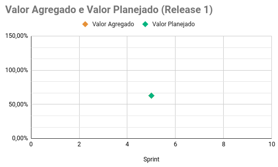
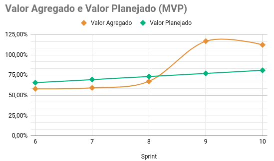
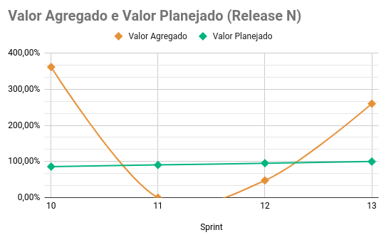
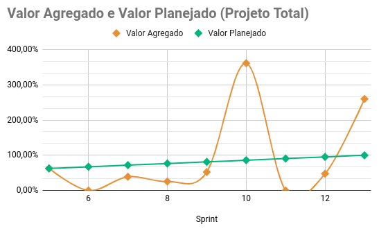

# EVM - Earned Value Management

O EVM é uma metodologia de gerenciamento de projeto que integra cronograma, custos e escopo para medir o desempenho do projeto. Com base em valores planejados e reais, o EVM pode prever o futuro e permitir que os gerentes de projeto se ajustem de acordo. O EVM utiliza o EVA como uma de suas ferramentas, sendo EVA  a análise de valor agregado. É uma técnica quantitativa usada para avaliar o desempenho do projeto calculando o cronograma e as variações de custo.

Uma vez que você está 20% em um projeto, seu desempenho atual pode ser usado para prever o futuro do projeto com um desvio de mais ou menos 10%. Esta poderosa capacidade preditiva é possibilitada pelo EVM, tornando-o uma das melhores medidas de controle de custos de projeto disponíveis.

Para melhor entender o funcionamento do EVM, foi utilizado o artigo [*AgileEVM – Earned Value Management in Scrum Projects*](https://34slpa7u66f159hfp1fhl9aur1-wpengine.netdna-ssl.com/wp-content/uploads/2014/11/Earned-Value-Analysis-in-Scrum-Projects.pdf). Foi utilizada como base a tabela feita pelo grupo [**Ada**](https://fga-eps-mds.github.io/2019.1-ADA/#/docs/product/agile_earned_value_management).

## Histórico de Revisão
| Data | Versão | Descrição | Autor |
|------|--------|-----------|-------|
| 06/10/2021 | 1.0 | Documentação dinâmica do EVM | Micaella Gouveia |
| 28/10/2021 | 1.1 | Adição das análises da R1 e MVP | Micaella Gouveia |
| 08/11/2021 | 1.2 | Correção das análises da R1 e MVP e adição da análise da RN | Micaella Gouveia |
| 10/11/2021 | 1.3 | Correção das análises da R1, MVP e RN | Micaella Gouveia |

## EVM - Multilind

Para o monitoramento foram consideradas as sprints de desenvolvimento, que começaram na Sprint 4, totalizando 3 meses de desenvolvimento do projeto. As análises de custos iniciais foram feitas anteriormente em [**Custos do Projeto**](Project/custos.md).

<iframe src="https://docs.google.com/spreadsheets/d/e/2PACX-1vQLyduqI-13LR_8Mrl7f4B3EwyqbJUiTDZV0blZ9_96dupWKqRyj4xOV6nMPeqMaDnNQVGLXQbGndVW/pubhtml" width="900px" height="600px"></iframe>

## Análise das Major Releases
A partir dos gráficos gerados de Valor Planejado x Valor Agregado de cada major release, foi possível fazer uma análise dos custos do projeto em seu desenvolvimento. É possível ver todos os gráficos na tabela acima na aba "Gráficos".

### Release 1

A Release 1 contou apenas com 1 sprint de desenvolvimento. Por isso, podemos notar que o gráfico contém apenas dois pontos representando o valor planejado e agregado. Aqui, como nenhuma US foi entregue, há essa discrepância no gráfico. 

Assim essa release teve 16 pontos planejados e 0 pontos entregues, gerando uma pontuação adicionada à próxima sprint.

### MVP 

Para a entrega do MVP contamos com 4 sprints de desenvolvimento. Pelo gráfico podemos analisar que durante as primeiras 3 sprints o time não conseguiu agregar o valor planejado, mas isso não quer dizer que todas as funcionalidades para o MVP não foram entregues, pois esse débito que ficou diz respeito ao desenvolvimento de US de outras funcionalidades que não entravam no MVP.

É possível notar também que o valor planejado sempre se mantém em crescimento constante. Isso se dá pois o projeto aplica metodologias ágeis, que enfatizam os conceitos de pequenas entregas contínuas.

No fim, é possível entender que, o projeto até aqui, tentou se manter nesse padrão de entregas contínuas e que ao final da entrega do MVP, todas as funcinalidades propostas foram entregues.

Assim, essa entrega teve 96 pontos planejados e 80 pontos entregues, dívidas essas que diz respeito a funcionalidades da próxima entrega.

### Release N

Para a entrega Final contamos com 4 sprints de desenvolvimento. Essa última fase ficou destinada ao desenvolvimento das funcionalidades do usuário administrador e publicação de novos conteúdos. Nele podemos ver uma diminuição do valor agregado pois a equipe teve que lidar com novas tecnologias que ainda não tinham sido utilizadas e pela sobrecarga do fim do semestre, mas no fim, todas as dívidas técnicas foram sanadas :), entregando assim todas as funcionalidades propostas.

### Análise Total

Pode-se notar que durante as primeiras semanas o valor agregado ficou abaixo por causa da falta de conhecimento com as tecnologias e a falta de conhecimento do velocity da equipe, mas com a entrega do MVP, começamos a entender o ritmo da equipe, mas no fim, tensões do fim de semestre, aliado com entregas de outras matérias, prejudicou a entrega contínua, mas no fim, tudo foi entregue :)
## Referências
* Earned Value Management: The Basics. Disponível em <https://www.ecosys.net/knowledge/earned-value-management-basics/>. Último acesso em 06/10/2021.
* AgileEVM – Earned Value Management in Scrum Projects. Disponível em <https://34slpa7u66f159hfp1fhl9aur1-wpengine.netdna-ssl.com/wp-content/uploads/2014/11/Earned-Value-Analysis-in-Scrum-Projects.pdf>. Último acesso em 06/10/2021.