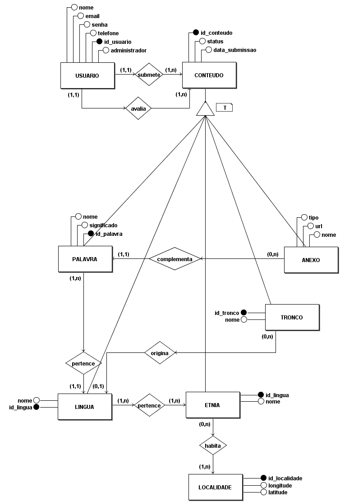
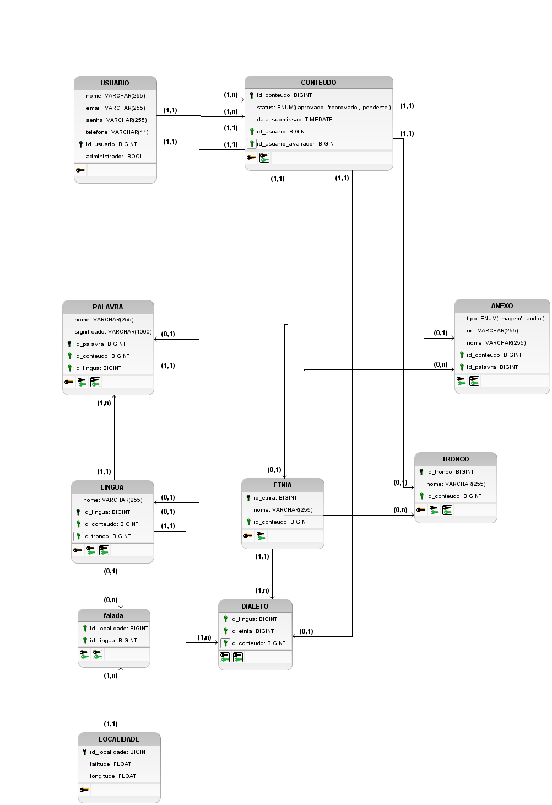

# Diagrama Entidade Relacionamento
O Modelo Entidade Relacionamento tem por finalidade modelar todo o banco de dados do sistema com suas respectivas tabelas e relacionamentos. Esse documento é composto por um MER (Modelo Entidade Relacionamento), DER (Diagrama Entidade Relacionamento), DL (Diagrama Lógico) e o seu respectivo Dicionário de Dados.

## Histórico de Revisões
| Data | Versão | Descrição | Autor(es) |
|:----:|:------:|:---------:|:---------:|
| 03/09/2021 | 0.1 | Reunião para modelagem do Banco de Dados | EPS e MDS |
| 04/09/2021 | 1.0 | Crição do documento e adição do MER | Pedro Igor |
| 04/09/2021 | 1.1 | Adição do DER | Pedro Igor |
| 04/09/2021 | 1.2 | Adição do DLD | Pedro Igor |

## Modelo Entidade Relacionamento (MER)

### Entidades
- USUARIO
- CONTEUDO
- PALAVRA
- ANEXO
- TRONCO
- LINGUA
- ETNIA
- LOCALIDADE

### Tabelas
- pertence
- habita

### Relacionamentos
USUARIO - **submete** - CONTEUDO 
Um USUARIO **submete** um ou mais CONTEUDOS (N). 
Um CONTEUDO é **submetido** por um e somente um USUARIO (1). 
Cardinalidade: 1xN 

USUARIO - **avalia** - CONTEUDO 
Um USUARIO **avalia** um ou mais CONTEUDOS (N). 
Um CONTEUDO é **avaliado** por um e somente um USUARIO (1). 
Cardinalidade: 1xN 

ANEXO - **complementa** - PALAVRA 
Um ANEXO **complementa** uma e somente um PALAVRA (1). 
Uma PALAVRA é **complementada** por um ou mais ANEXOS (N). 
Cardinalidade: Nx1 

PALAVRA - **pertence** - LINGUA 
Uma PALAVRA **pertence** a uma e somente uma LINGUA (1). 
Uma PALAVRA **possui** uma ou mais PALAVRAS (N). 
Cardinalidade: 1xN 

TRONCO - **origina** - LINGUA 
Um TRONCO **origina** uma ou mais LINGUAS (N). 
Uma LINGUA é **originada** por um e somente um TRONCO (1). 
Cardinalidade: 1xN

LINGUA - **pertence** - ETNIA 
Uma LINGUA **pertence** a uma ou mais ETNIAS (N). 
Uma ETNIA **possui** uma oua mais LINGUAS(M). 
Cardinalidade: NxM 

ETNIA - **habita** - LOCALIDADE 
Uma ETNIA **habita** em uma ou mais LOCALIDADES (M). 
Uma LOCALIDADE pode **habitar** zero ou mais ETNIAS(N). 
Cardinalidade: NxM 

## Diagrama Entidade Relacionamento (DER)

[Arquivo editável no BRModelo](https://github.com/fga-eps-mds/2021.1-Multilind-Docs/raw/main/docs/img/modelagemBancoDeDados/conceitual.brM3)

## Diagrama Lógico (DLD)

[Arquivo editável no BRModelo](https://github.com/fga-eps-mds/2021.1-Multilind-Docs/raw/main/docs/img/modelagemBancoDeDados/logico.brM)

## Referências 
- Software para Diagramação do Modelo Entidade Relacionamento - brModelo <http://www.sis4.com/brModelo/>. Último acesso em 04/09/2021