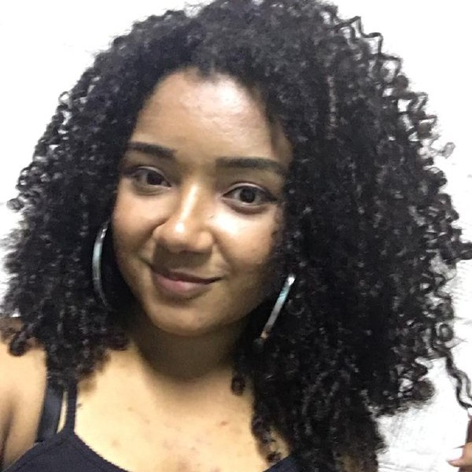
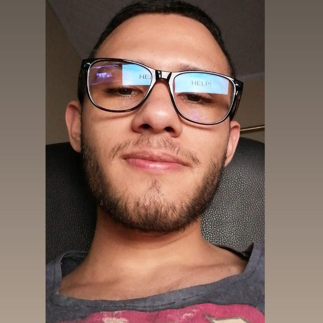
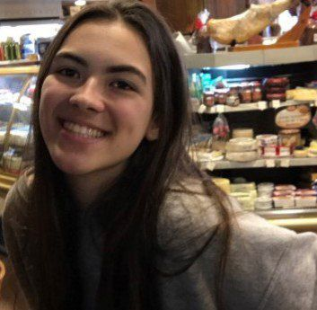
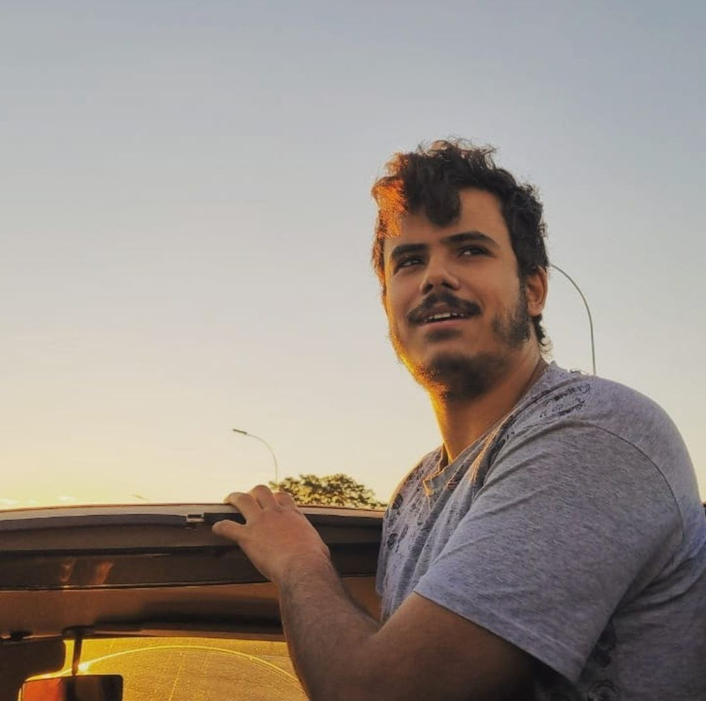
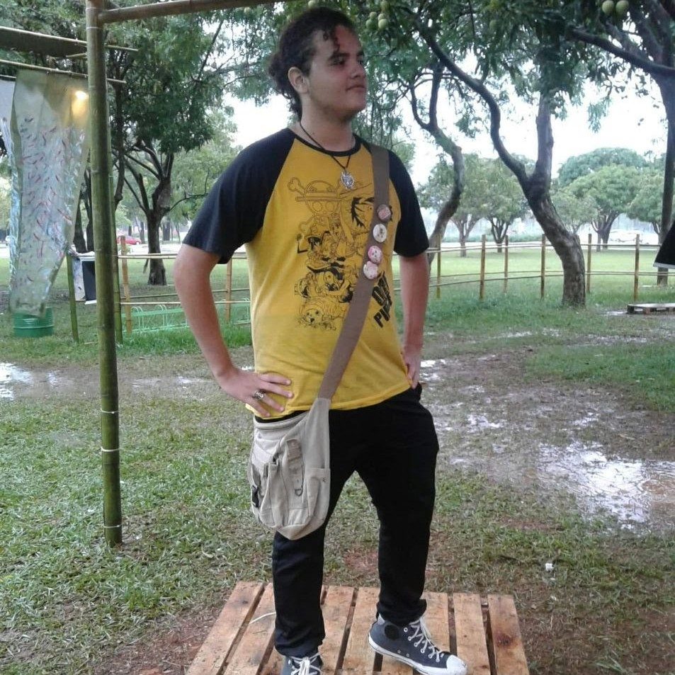
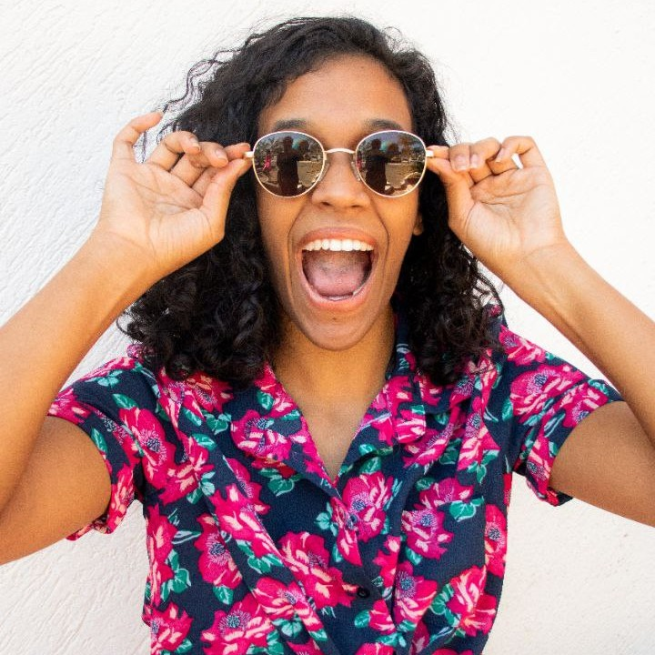
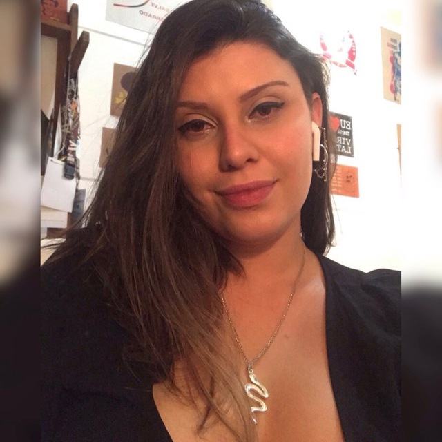

  <h2>MDS/EPS</h2>
  <h3>Sobre o projeto</h3>

  Trata-se de um sistema para mapeamento de línguas indígenas e de português indígena. 
  
  <h3>Membros da equipe</h3>

  

    

      
Ingrid Carvalho (MDS)

      
    

    

      
Gabriel Davi (EPS)

      
    

    

      
Isadora Galvão (MDS)

      
    
    
  

  

    

      
Hérick Lima (MDS)

      
    

    

      
Helder Lourenço (MDS)

      
    
   
    

      
Carlos Rafael (MDS)

      
    

  

  

    

      
Micaella Gouveia (EPS)

      
    

    

      
Pedro Igor (EPS)

      
    

    

      
Sofia Patrocínio (EPS)

      
    
   
  

  

  

