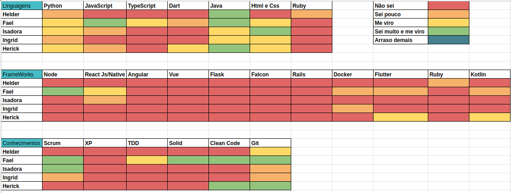
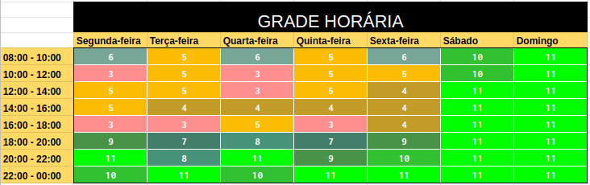

# Planejamento Sprint 0

**Período: 26/07/2021 a 07/08/2021** 
**Data da Reunião: 31/07/2021**

## Issues

| Número | Issue | Pontuação | Participantes |
|--------|-------|-----------|---------------|
| [**#1**](https://github.com/fga-eps-mds/2021.1-Linguas-Indigenas-Docs/issues/1) | Treinamento Html/Css | Sem | Todos |
| [**#2**](https://github.com/fga-eps-mds/2021.1-Linguas-Indigenas-Docs/issues/2) | Treinamento Javascript | Sem | Todos |
| [**#3**](https://github.com/fga-eps-mds/2021.1-Linguas-Indigenas-Docs/issues/3) | Treinamento Git | Sem | Todos |
| [**#4**](https://github.com/fga-eps-mds/2021.1-Linguas-Indigenas-Docs/issues/4) | Treinamento Scrum | Sem | Sofia Patrocínio |
| [**#5**](https://github.com/fga-eps-mds/2021.1-Linguas-Indigenas-Docs/issues/5) | Criar Guia de Contribuição | Sem | Gabriel Davi |
| [**#6**](https://github.com/fga-eps-mds/2021.1-Linguas-Indigenas-Docs/issues/6) | Criar Pull Request Template | Sem | Pedro Igor |
| [**#7**](https://github.com/fga-eps-mds/2021.1-Linguas-Indigenas-Docs/issues/7) | Criar Issue Template | Sem | Sofia Patrocínio |
| [**#9**](https://github.com/fga-eps-mds/2021.1-Linguas-Indigenas-Docs/issues/9) | Configurações Iniciais Sprint 0 | Sem | Micaella Gouveia |

## Pontuação : Sem pontuação

## Quadro de Distribuição de Pontos

Este quadro divide a pontuação das issues com a quantidade de participantes, para ter a noção da distribuição de pontos por pessoa, evitando a sobrecarga de tarefas para algum membro.

_Nesta Sprint não foi feita a pontuação das issues._

## Relato

- Durante a primeira semana da Sprint 0 foi decido a realização de treinamentos para os MDS a fim de alinhar o grupo com algumas tecnologias e conhecimentos necessários para o desenvolvimento do projeto.

- Para a realização dos treinamentos, foi feito um quadro de conhecimento entre os MDS para entender quais eram as principais dificuldades.

- Cada EPS ficou responsável em dar um treinamento, e cada um ficou agendado da seguinte forma:

| Treinamento | Resposável | Data Realização |
|-------------|------------|-----------------|
| Html/Css | Gabriel Alves | 27/07/2021 |
| Javascript | Pedro Igor | 28/07/2021 |
| Git | Sofia Patrocínio| 29/07/2021 |
| Scrum | Micaella | 30/07/2021 |

- Para definição do dia das reuniões semanas e reuniões com a cliente, foi feita uma grade horária em conjunto.

- As reuniões então ficaram definidas para sábado das 14h as 18h, e com o cliente nas sextas 18h.

- Para a segunda semana da Sprint 0 foi decidido o início das primeiras configurações do repositório.