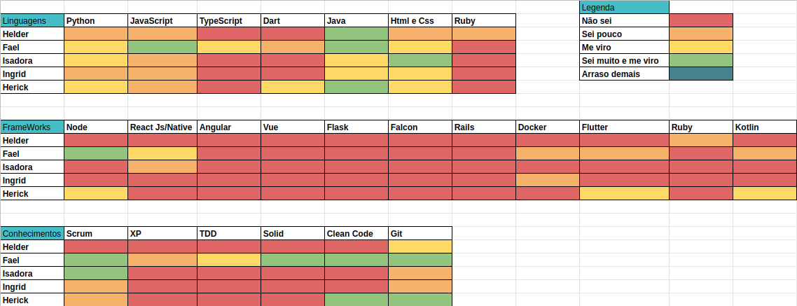
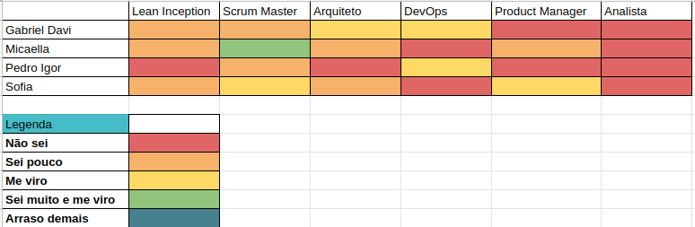
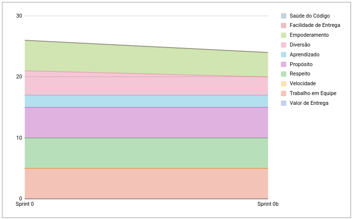
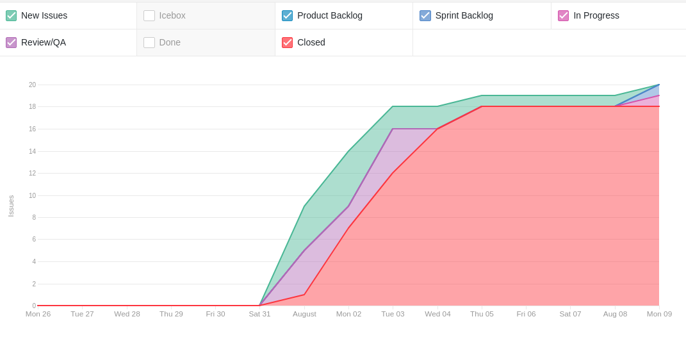
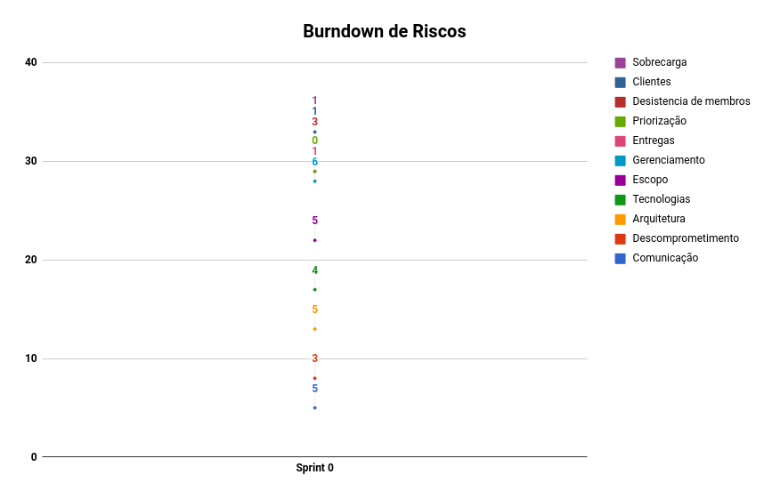

# Resultados Semana de Planejamento 0

**Período: 26/07/2021 a 07/08/2021** 
**Data da Reunião: 07/08/2021**

## Issues Entregues
| PR | Issue | Descrição | Participantes |
|----|-------|-----------|---------------|
| [**#19**](https://github.com/fga-eps-mds/2021.1-Linguas-Indigenas-Docs/pull/19) | [**#1**](https://github.com/fga-eps-mds/2021.1-Linguas-Indigenas-Docs/issues/1) | Treinamento Html/Css | Todos |
| [**#11**](https://github.com/fga-eps-mds/2021.1-Linguas-Indigenas-Docs/pull/11) | [**#2**](https://github.com/fga-eps-mds/2021.1-Linguas-Indigenas-Docs/issues/2) | Treinamento Javascript | Todos |
| [**#16**](https://github.com/fga-eps-mds/2021.1-Linguas-Indigenas-Docs/pull/16) | [**#3**](https://github.com/fga-eps-mds/2021.1-Linguas-Indigenas-Docs/issues/3) | Treinamento Git | Todos |
| [**#15**](https://github.com/fga-eps-mds/2021.1-Linguas-Indigenas-Docs/pull/15) | [**#4**](https://github.com/fga-eps-mds/2021.1-Linguas-Indigenas-Docs/issues/4) | Treinamento Scrum | Sofia Patrocínio |
| [**#12**](https://github.com/fga-eps-mds/2021.1-Linguas-Indigenas-Docs/pull/12) | [**#6**](https://github.com/fga-eps-mds/2021.1-Linguas-Indigenas-Docs/issues/6) | Criar Pull Request Template | Pedro Igor |
| [**#8**](https://github.com/fga-eps-mds/2021.1-Linguas-Indigenas-Docs/pull/8) | [**#7**](https://github.com/fga-eps-mds/2021.1-Linguas-Indigenas-Docs/issues/7) | Criar Issue Template | Sofia Patrocínio |
| [**#10**](https://github.com/fga-eps-mds/2021.1-Linguas-Indigenas-Docs/pull/10) | [**#9**](https://github.com/fga-eps-mds/2021.1-Linguas-Indigenas-Docs/issues/9) | Configurações Iniciais Sprint 0 | Micaella Gouveia |
| [**#14**](https://github.com/fga-eps-mds/2021.1-Linguas-Indigenas-Docs/pull/14) | [**#13**](https://github.com/fga-eps-mds/2021.1-Linguas-Indigenas-Docs/issues/13) | Documentar Metodologias e Ferramentas | Micaella Gouveia |

Para as issues de treinamento foi criado um documento que especifica todo o conteúdo utilizado nos [DOJOS](Index/dojosIndex.md).

## Issues Não Entregues
| Número | Issue | Pontuação | Participantes |
|--------|-------|-----------|---------------|
| [**#5**](https://github.com/fga-eps-mds/2021.1-Linguas-Indigenas-Docs/issues/5) | Criar Guia de Contribuição | Sem | Gabriel Davi |

## Dívidas Técnicas
A issue [**#5**](https://github.com/fga-eps-mds/2021.1-Linguas-Indigenas-Docs/issues/5) ficou em backlog para ser feita quando se iniciar o desenvolvimento em código.

## Quadro de Conhecimento (MDS)

## Quadro de Conhecimento (EPS)

## Burndown
*Como essa semana não foi pontuada, não há burndown.*

## Velocity
*Como essa semana não foi pontuada, não há velocity.*

## Health Check

## Cumulative Flow

## Burndown de Riscos

* Foi a primeira semana do time, o time de MDS e EPS ainda não se conhece muito bem, gerando uma dúvida em relação a comunicação e comprometimento, mas todos aparentaram estar empolgados com a matéria.

## Observações
- Foi realizada a primeira reunião com a cliente professora Altaci e seu grupo, para ter as primeiras impressões do produto a ser desenvolvido e para que as equipes se conhecessem.
- Nesta semana foi iniciada a Lean Inception, com a participação da professora Altaci, seu grupo e todos os integrantes do grupo de MDS e EPS.