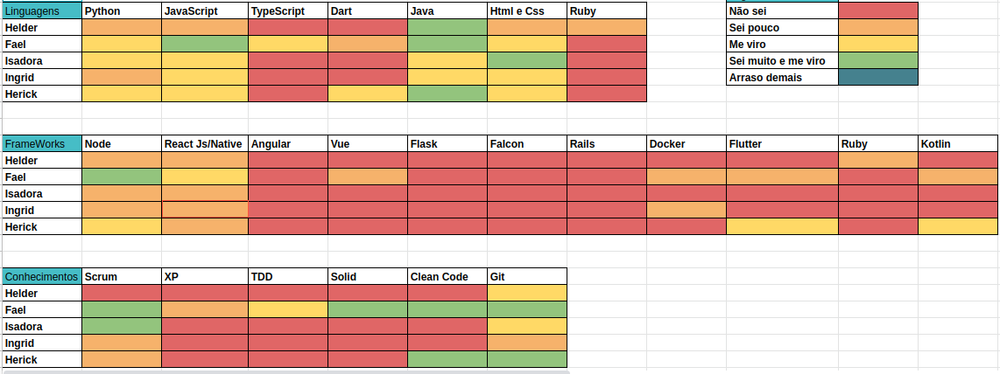
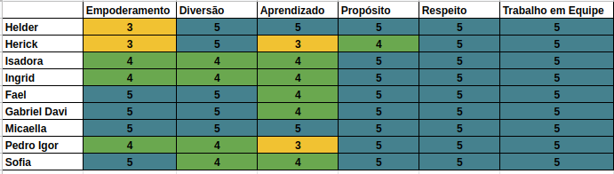
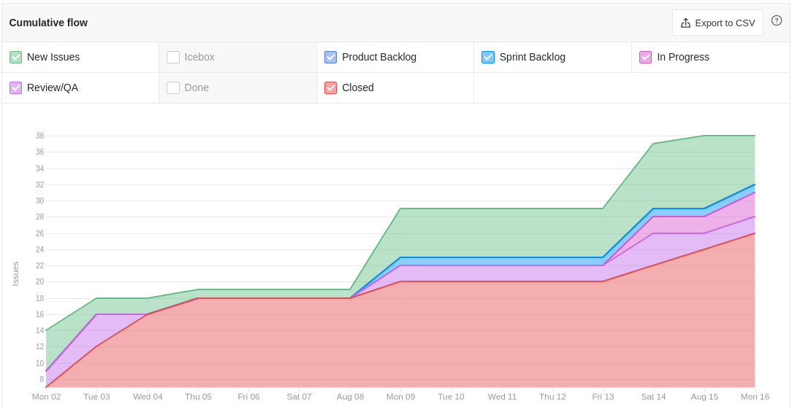
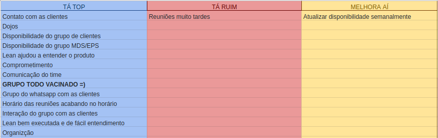
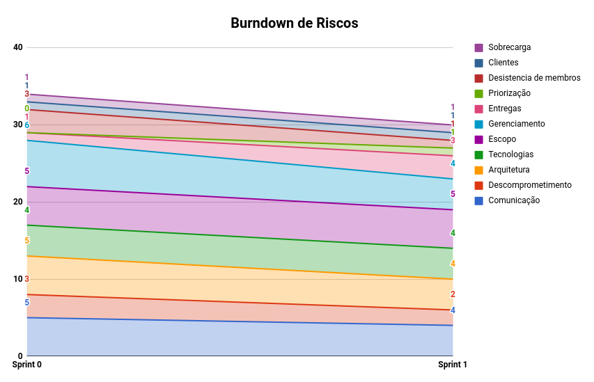

# Resultados Semana de Planejamento 1

**Período: 08/08/2021 a 15/08/2021** 
**Data da Reunião: 14/08/2021**

## Issues Entregues
| PR | Issue | Descrição | Participantes |
|----|-------|-----------|---------------|
| [**#37**](https://github.com/fga-eps-mds/2021.1-Linguas-Indigenas-Docs/pull/37) | [**#24**](https://github.com/fga-eps-mds/2021.1-Linguas-Indigenas-Docs/issues/24) | Lean 2 | Todos |
| [**#36**](https://github.com/fga-eps-mds/2021.1-Linguas-Indigenas-Docs/pull/36) | [**#25**](https://github.com/fga-eps-mds/2021.1-Linguas-Indigenas-Docs/issues/25) | Lean 3 | Todos |

Para as issues de treinamento foi criado um documento que especifica todo o conteúdo utilizado nos [DOJOS](Index/dojosIndex.md).

## Issues Não Entregues
| PR | Issue | Descrição | Participantes |
|----|-------|-----------|---------------|
| - | [**#23**](https://github.com/fga-eps-mds/2021.1-Linguas-Indigenas-Docs/issues/23) | Lean 1 | Todos |
| [**#38**](https://github.com/fga-eps-mds/2021.1-Linguas-Indigenas-Docs/pull/38) | [**#26**](https://github.com/fga-eps-mds/2021.1-Linguas-Indigenas-Docs/issues/26) | Lean 4 | Todos |
| - | [**#27**](https://github.com/fga-eps-mds/2021.1-Linguas-Indigenas-Docs/issues/26) | Dojo de Node | Todos |
| - | [**#28**](https://github.com/fga-eps-mds/2021.1-Linguas-Indigenas-Docs/issues/26) | Dojo de React | Todos |

## Quadro de Conhecimento (MDS)

## Quadro de Conhecimento (EPS)

## Burndown
*Como essa semana não foi pontuada, não há burndown.*

## Velocity
*Como essa semana não foi pontuada, não há velocity.*

## Health Check

## Cumulative Flow

## Retrospectiva

## Burndown de Riscos

* Nesta semana houve a fnalização da Lean, a ideia do produto e escopo foram melhor esclarescidos.
* Dúvidas em quais tecnologias serão utilizadas ainda existem.
* A comunicação com as clientes foi excelente.

## Observações
- Nesta semana foram finalizadas as atividades da Lean Inception. Tivemos a participação da professora Altaci e seu grupo em três dias da reunião, deixando o último dia apenas com o grupo de MDS/EPS.
- Foi possível também realizar os treinamentos de Node e React para alinhamento da equipe.