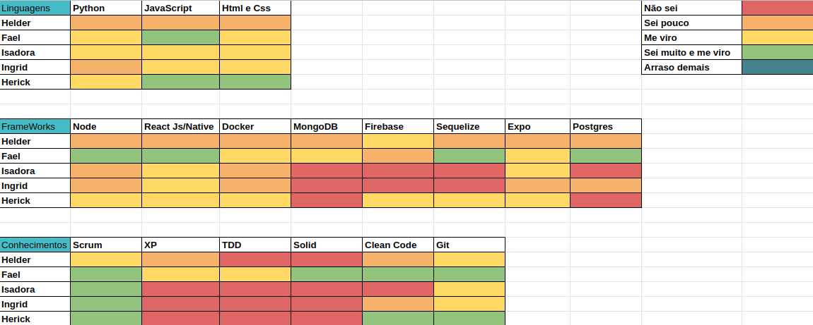
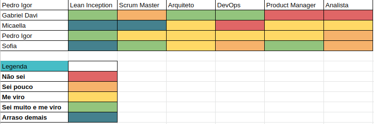
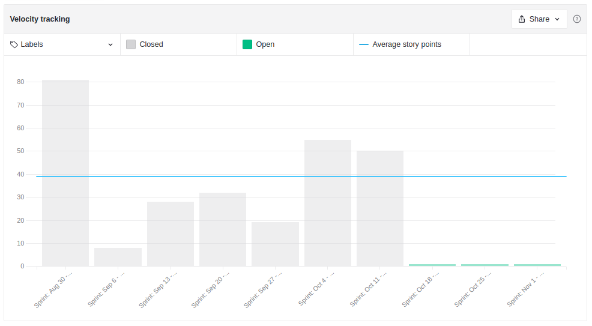
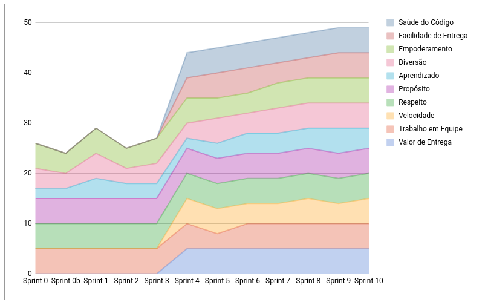
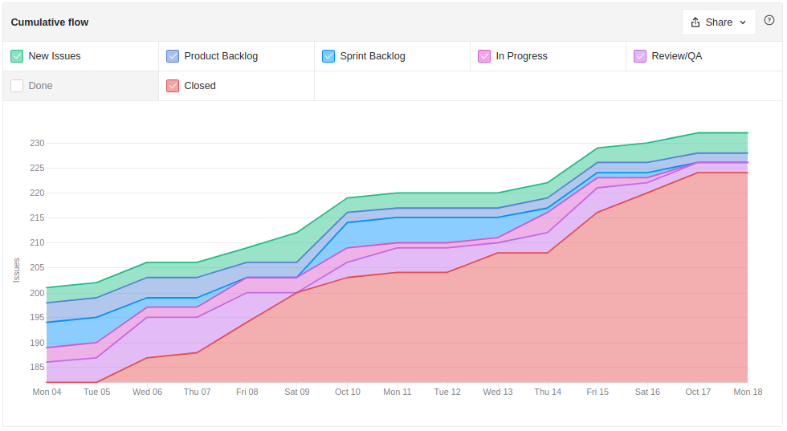
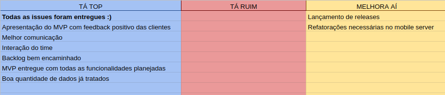

# Resultados Sprint 10

**Período: 11/10/2021 a 17/10/2021** 
**Data da Reunião: 16/10/2021**

## Issues Entregues Dívidas Técnicas
| PR | Issue | Descrição | Pontuação | Participantes |
|----|-------|-----------|-----------|---------------|
| [**Mobile #18**](https://github.com/fga-eps-mds/2021.1-Multilind-Mobile-App/pull/18) |[**#111**](https://github.com/fga-eps-mds/2021.1-Multilind-Docs/issues/111) | US25 Localização do usúario - MAPA | 8 | MDS (+ EPS) |
| [**Admin #1**](https://github.com/fga-eps-mds/2021.1-Multilind-admin-website/pull/1) | [**#89**](https://github.com/fga-eps-mds/2021.1-Multilind-Docs/issues/89) | US01 Cadastro Usuário Administrador | 5 | EPS | Gabriel Davi |

### Pontuação Dívidas Técnicas : 13

## Issues Entregues
| Número | Issue | Pontuação | Participantes | Responsável |
|--------|-------|-----------|---------------|-------------|
| - | [**#154**](https://github.com/fga-eps-mds/2021.1-Multilind-Docs/issues/154) | Apresentação MVP | 5 | EPS + MDS |
| [**Mobile #17**](https://github.com/fga-eps-mds/2021.1-Multilind-Mobile-App/pull/17) e [**Content #22**](https://github.com/fga-eps-mds/2021.1-Multilind-content-server/pull/22) | [**#155**](https://github.com/fga-eps-mds/2021.1-Multilind-Docs/issues/155) | Refatorações e Cobertura de testes | 5 | MDS |
| [**Content #23**](https://github.com/fga-eps-mds/2021.1-Multilind-content-server/pull/23) e [**Content #15**](https://github.com/fga-eps-mds/2021.1-Multilind-content-server/pull/15) | [**#156**](https://github.com/fga-eps-mds/2021.1-Multilind-Docs/issues/156) | Popular base de dados com palavras e imagens | 13 | EPS + MDS |
| - |[**#157**](https://github.com/fga-eps-mds/2021.1-Multilind-Docs/issues/157) | Popular base de dados em deploy | 3 | EPS |
| [**Mobile #19**](https://github.com/fga-eps-mds/2021.1-Multilind-Mobile-App/pull/19) | [**#109**](https://github.com/fga-eps-mds/2021.1-Multilind-Docs/issues/109) | US22 Busca por palavras | 5 | MDS |
|- |[**#158**](https://github.com/fga-eps-mds/2021.1-Multilind-Docs/issues/158) | Criação do Web Service | 8 | EPS |
| [**Mobile #19**](https://github.com/fga-eps-mds/2021.1-Multilind-Mobile-App/pull/19)|[**#109**](https://github.com/fga-eps-mds/2021.1-Multilind-Docs/issues/109) | US22 Busca por palavras | 3 | MDS |

## Pontuação : 37 + 13

## Quadro de Conhecimento (MDS)

## Quadro de Conhecimento (EPS)

## Burndown

## Velocity

## Health Check

## Cumulative Flow

## Retrospectiva

## Burndown de Riscos

* A parte dos dados está bem encaminhado, mas ainda teremos que lidar com novos tratamentos.
* Equipe de MDS conseguiu entregar todas as issues antes da apresentação do MVP. 

## Observações
* Nesta Sprint tivemos a apresentação do MVP, que teve a participação do GT dos grupos indígenas. As principais funcionalidades foram apresentadas, além do protótipo do Web Service para os usuários administradores.
* Foram entregues as primeiras tarefas relacionadas ao épico de Usuário Administrador.
