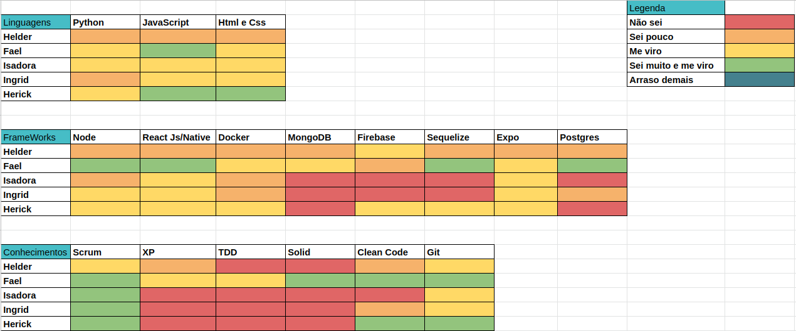
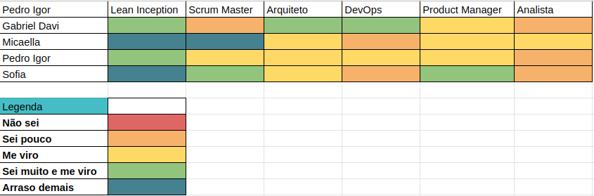
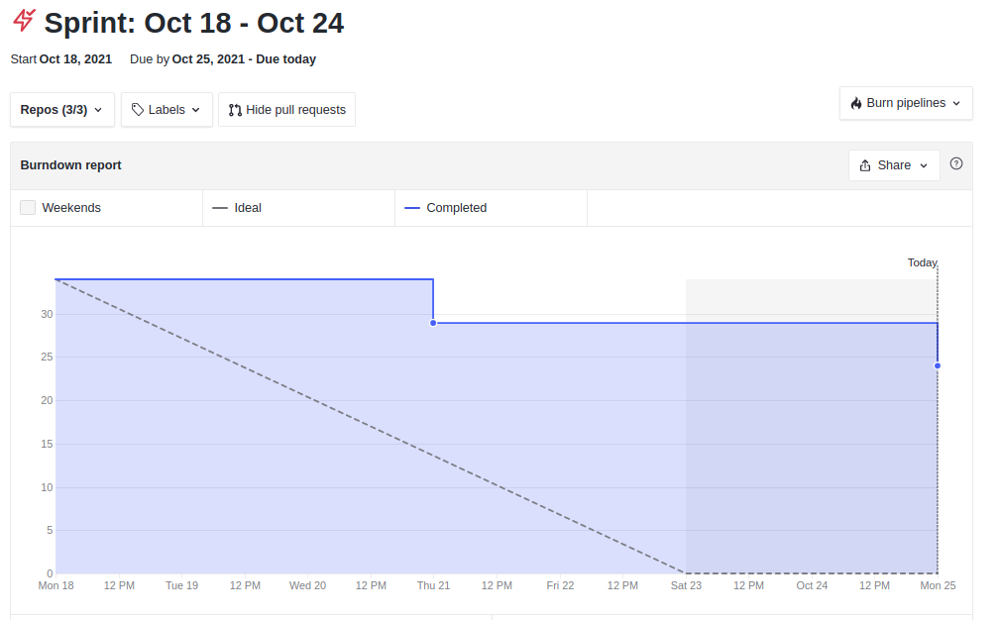
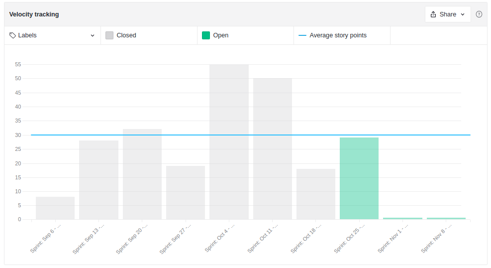
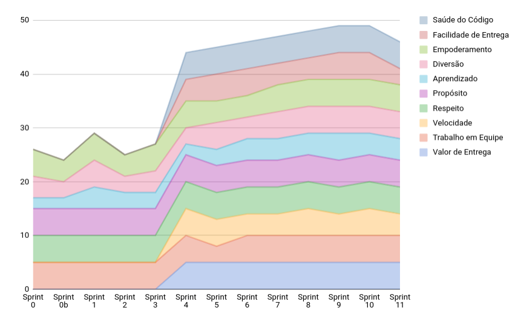
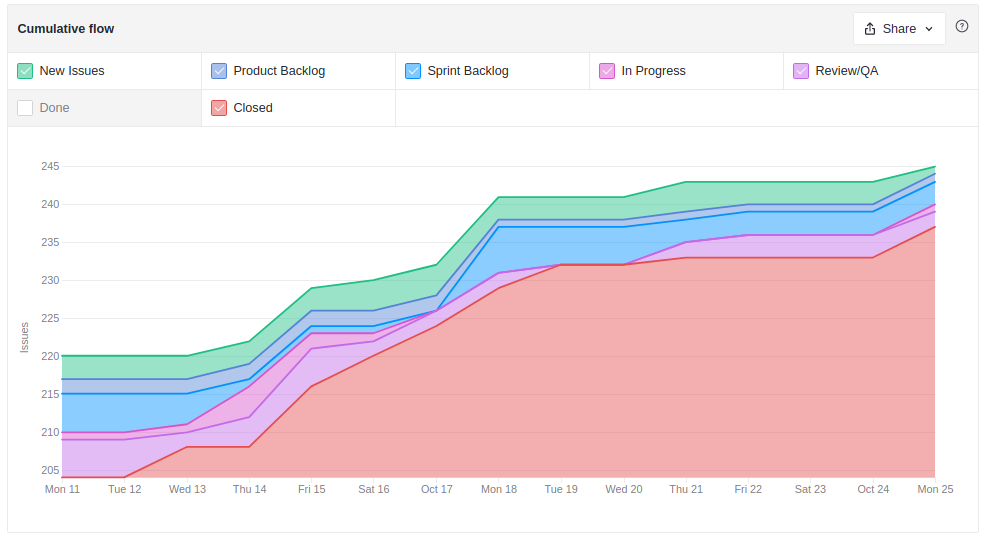
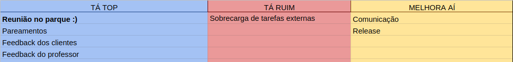
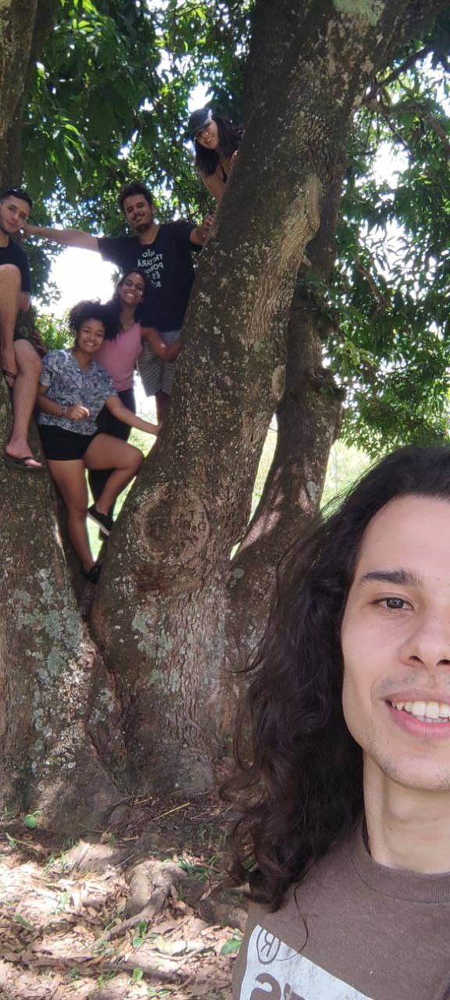

# Resultados Sprint 11

**Período: 18/10/2021 a 24/10/2021** 
**Data da Reunião: 23/10/2021**

## Issues Entregues
| PR | Issue | Descrição | Pontuação | Participantes |
|----|-------|-----------|-----------|---------------|
| [**Files #16**](https://github.com/fga-eps-mds/2021.1-Multilind-files-server/pull/16)  [**Content #26**](https://github.com/fga-eps-mds/2021.1-Multilind-content-server/pull/26)|[**#162**](https://github.com/fga-eps-mds/2021.1-Multilind-Docs/issues/162) |Tratamento de Dados Funai | 13 | EPS| Pedro Igor |
| [**Mobile #21**](https://github.com/fga-eps-mds/2021.1-Multilind-Mobile-App/pull/21) [**Mobile #22**](https://github.com/fga-eps-mds/2021.1-Multilind-Mobile-App/pull/22)|[**#164**](https://github.com/fga-eps-mds/2021.1-Multilind-Docs/issues/164) | Tela de uma imagem | 5 |MDS | Ingrid |
| - |[**#165**](https://github.com/fga-eps-mds/2021.1-Multilind-Docs/issues/165) | Protótipo Alta Fidelidade Admin Web | 5 | EPS | Sofia Patrocínio |

## Pontuação : 23

## Dívidas Técnicas: 24
| Número | Issue | Pontuação | Participantes | Responsável |
|--------|-------|-----------|---------------|-------------|
| [**#90**](https://github.com/fga-eps-mds/2021.1-Multilind-Docs/issues/90) | US02 Avaliação de conteúdos Parte 1 | 8 | MDS | Carlos Rafael e Helder |
| [**#163**](https://github.com/fga-eps-mds/2021.1-Multilind-Docs/issues/163) | Refatoração: Deixar dicionário em Pt, páginação | 8 | MDS | Hérick e Isadora |
| [**#166**](https://github.com/fga-eps-mds/2021.1-Multilind-Docs/issues/166) | Métricas Sonar Cloud | 8 | EPS | Micaella Gouveia e Gabriel Davi |

## Quadro de Conhecimento (MDS)

## Quadro de Conhecimento (EPS)

## Burndown

## Velocity

## Health Check

## Cumulative Flow

## Retrospectiva

## Burndown de Riscos

* Com o final do semestre, muitos membros estão sobrecarregados com outras matérias, gerando dívidas técnicas e muito cansaço.
* A comunicação com as clientes e o professor estão eficientes. Tivemos uma reunião com todos para alinhamentos das decisões finais do projeto.

## Observações
* O grupo de MDS ficou muito sobrecarregado com outras matérias, gerando atrasos nas entregas das US.
* O grupo de EPS ainda não conseguiu gerar as métricas do sonar cloud, sendo essa uma entrega muito importante para a matéria, entrará como prioridade semana que vem.
* Nesta Sprint, com todos os membros vacinados, conseguimos fazer uma reunião presencial ao ar livre, tivemos a oportunidade de nos conhecer pessoalmente :)

