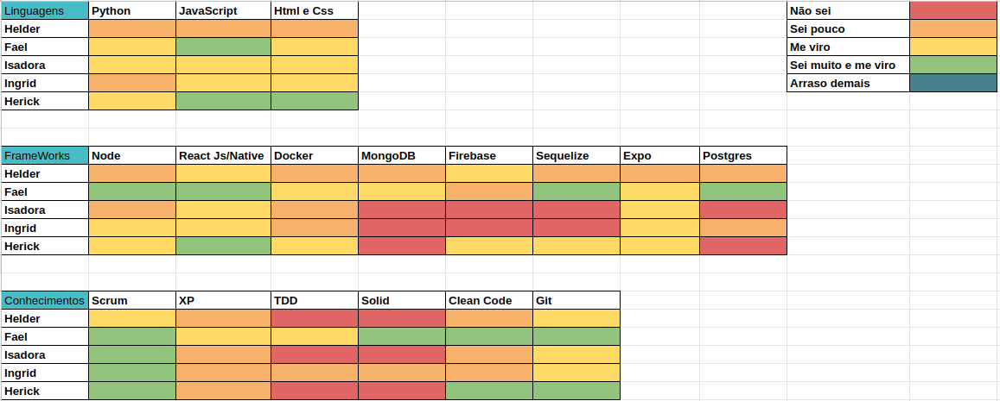
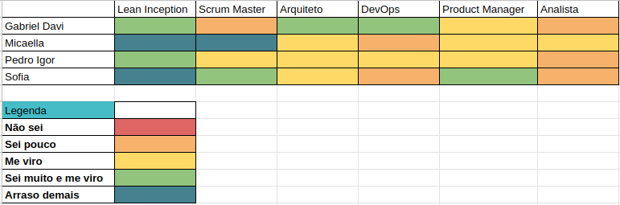
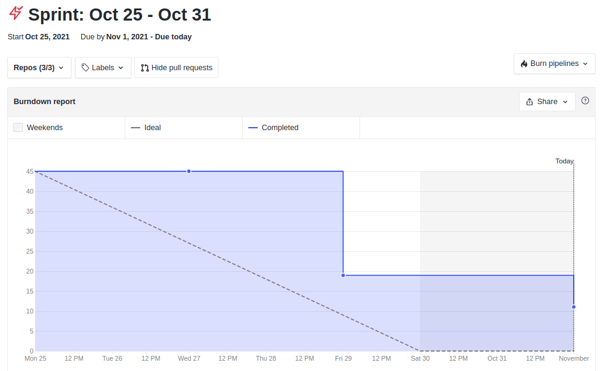
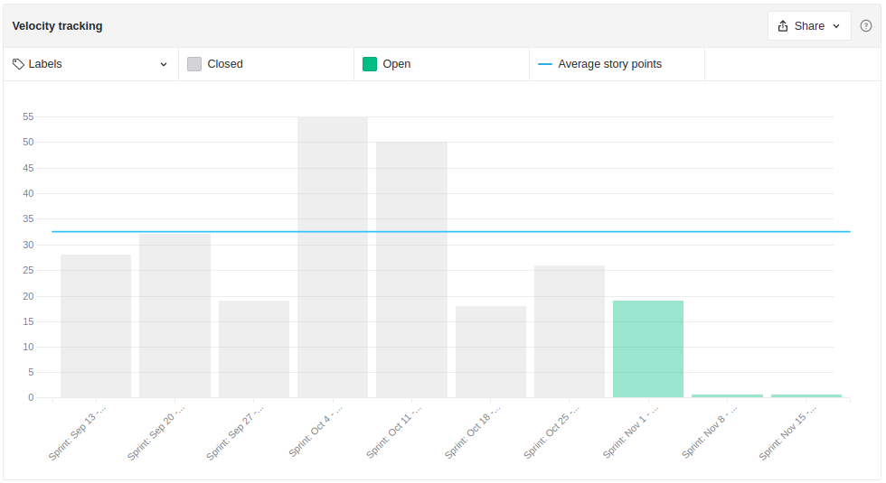
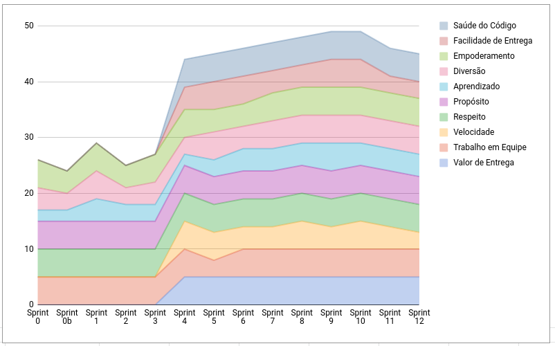
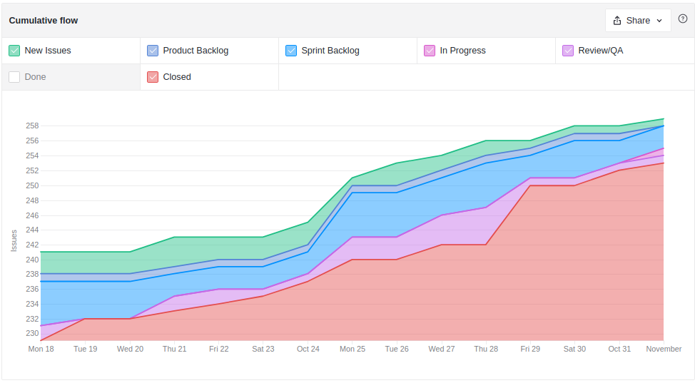
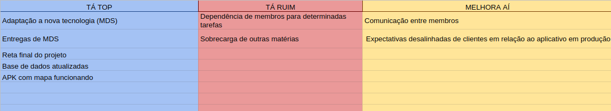
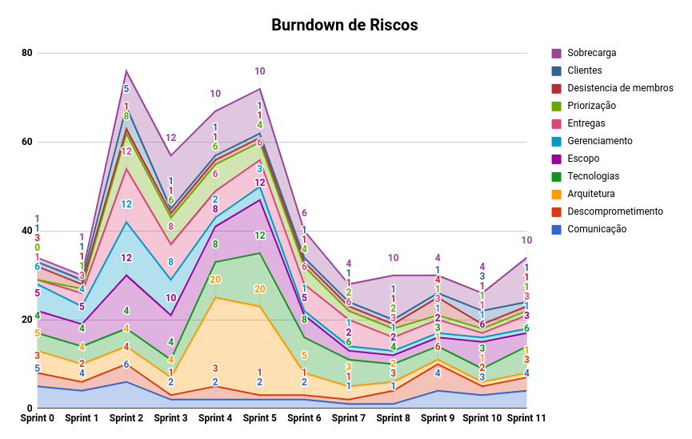

# Resultados Sprint 12

**Período: 25/10/2021 a 31/10/2021** 
**Data da Reunião: 30/10/2021**

## Issues Entregues Dívidas Técnicas
| PR | Issue | Descrição | Pontuação | Participantes |
|----|-------|-----------|-----------|---------------|
| [**Admin #3**](https://github.com/fga-eps-mds/2021.1-Multilind-admin-website/pull/3)   [**Content #29**](https://github.com/fga-eps-mds/2021.1-Multilind-content-server/pull/29) | [**#90**](https://github.com/fga-eps-mds/2021.1-Multilind-Docs/issues/90) | US02 Avaliação de conteúdos Parte 1 | 8 | MDS |
| [**Content #27**](https://github.com/fga-eps-mds/2021.1-Multilind-content-server/pull/27) [**Mobile #23**](https://github.com/fga-eps-mds/2021.1-Multilind-Mobile-App/pull/23) | [**#163**](https://github.com/fga-eps-mds/2021.1-Multilind-Docs/issues/163) | Refatoração: Deixar dicionário em Pt, páginação | Sem | MDS |

## Issues Entregues
| PR | Issue | Descrição | Pontuação | Participantes |
|----|-------|-----------|-----------|---------------|
| [**Mobile #24**](https://github.com/fga-eps-mds/2021.1-Multilind-Mobile-App/pull/24) | [**#170**](https://github.com/fga-eps-mds/2021.1-Multilind-Docs/issues/170) | Bug: Lista de Imagens e Detalhes da Língua | Sem | MDS |
| [**Content #28**](https://github.com/fga-eps-mds/2021.1-Multilind-content-server/pull/28) | [**#171**](https://github.com/fga-eps-mds/2021.1-Multilind-Docs/issues#171) | Atualizar Modelagem do Banco | Sem | EPS |

## Pontuação: 8

## Dívidas Técnicas: 8
| Número | Issue | Pontuação | Participantes | Responsável |
|--------|-------|-----------|---------------|-------------|
| [**#90**](https://github.com/fga-eps-mds/2021.1-Multilind-Docs/issues/90) | US02 Avaliação de conteúdos Parte 2 | 8 | MDS | Carlos Rafael e Hérick |
| [**#166**](https://github.com/fga-eps-mds/2021.1-Multilind-Docs/issues/166) | Métricas Sonar Cloud | Sem | EPS | Micaella Gouveia e Gabriel Davi |
| [**#169**](https://github.com/fga-eps-mds/2021.1-Multilind-Docs/issues/169) | Página Sobre | Sem | MDS | Helder |

## Quadro de Conhecimento (MDS)

## Quadro de Conhecimento (EPS)

## Burndown

## Velocity

## Health Check

## Cumulative Flow

## Retrospectiva

## Burndown de Riscos

* Com o final do semestre, muitos membros estão sobrecarregados com outras matérias, gerando dívidas técnicas e muito cansaço.
* A comunicação com as clientes e o professor nesta reta final está cansativa.
* A falha de comunicação entre os membros essa semana deixou a renião com os clientes desorganizada.

## Observações
* O grupo de MDS ficou muito sobrecarregado com outras matérias, gerando atrasos nas entregas das US.
* O grupo de EPS ainda não conseguiu gerar as métricas do sonar cloud, sendo essa uma entrega muito importante para a matéria, entrará como prioridade semana que vem.
* Nesta Sprint iremos apresentar nossa Entrega Final aos clientes na sexta dia 05/11/2021.
* Para essa reta final, quase todas as US estão entregues, faltando apenas a US02 e US06.

