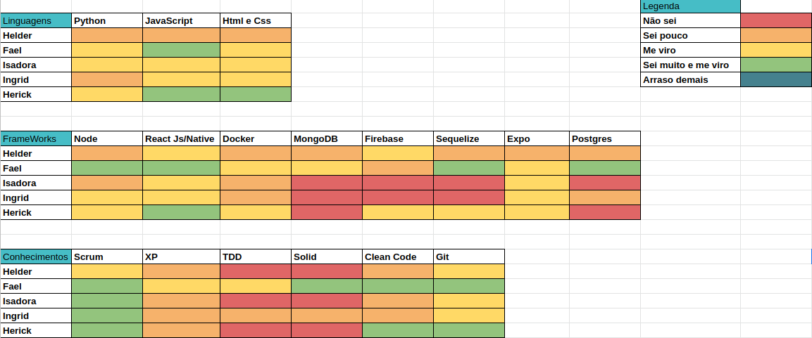
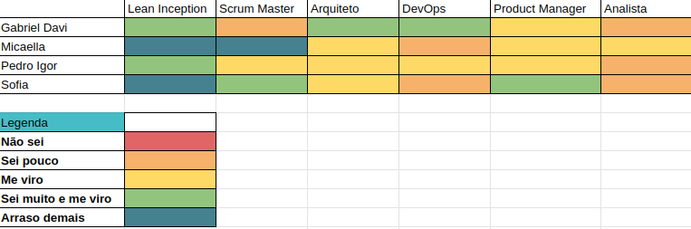
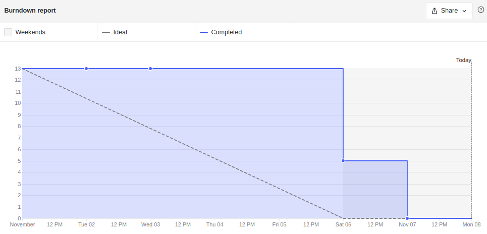
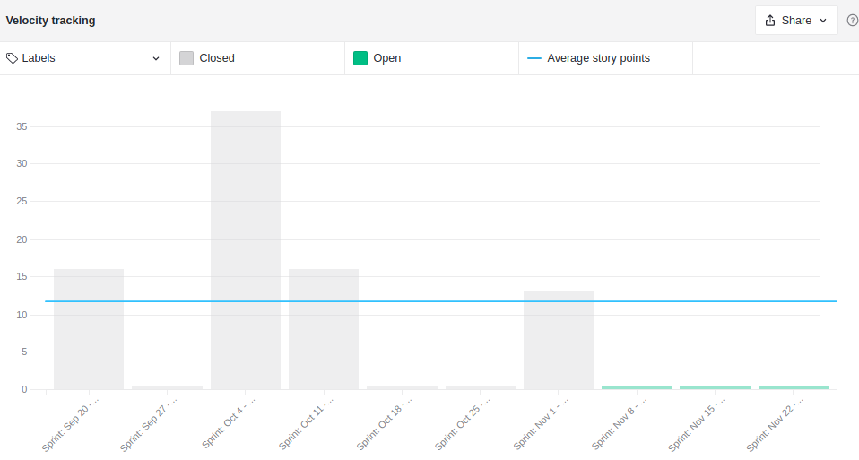
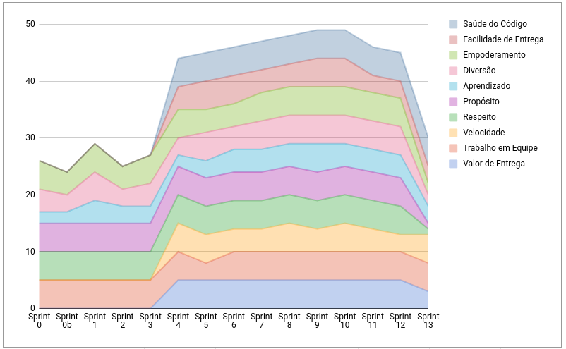
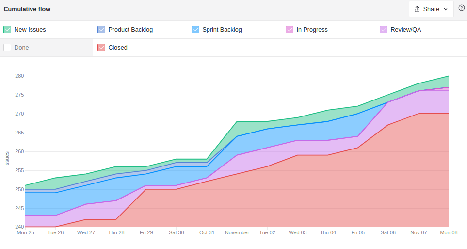
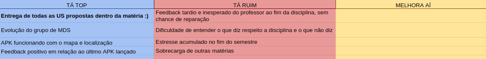
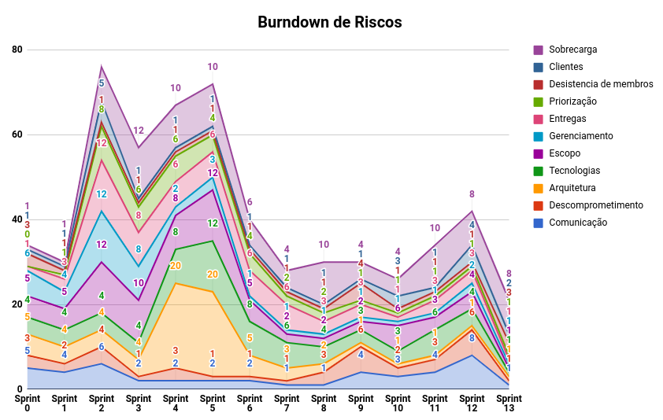

# Resultados Sprint 9

**Período: 01/11/2021 a 08/11/2021** 
**Data da Reunião: 06/11/2021**

## Issues Entregues Dívidas Técnicas
| PR | Issue | Descrição | Pontuação | Participantes |
|----|-------|-----------|-----------|---------------|
| [**#90**](https://github.com/fga-eps-mds/2021.1-Multilind-Docs/issues/90) | US02 Avaliação de conteúdos Parte 2 | 8 | MDS | Helder e Hérick |
| [**#166**](https://github.com/fga-eps-mds/2021.1-Multilind-Docs/issues/166) | Métricas Sonar Cloud | Sem | EPS | Todos |
| [**#169**](https://github.com/fga-eps-mds/2021.1-Multilind-Docs/issues/169) | Página Sobre | Sem | MDS | Carlos Rafael |

## Issues Entregues
| PR | Issue | Descrição | Pontuação | Participantes |
|----|-------|-----------|-----------|---------------|
| [**#94**](https://github.com/fga-eps-mds/2021.1-Multilind-Docs/issues/94) | US06 Adicionar Imagens | 5 | MDS | Isadora, Ingrid e Carlos Rafael |
| [**#175**](https://github.com/fga-eps-mds/2021.1-Multilind-Docs/issues/175) | Atualização Lista de Palavras | Sem | EPS | Pedro Igor |
| [**#176**](https://github.com/fga-eps-mds/2021.1-Multilind-Docs/issues/176) | Apresentação Entrega Final | Sem | EPS + MDS | Todos |
| [**#178**](https://github.com/fga-eps-mds/2021.1-Multilind-Docs/issues/178) | Melhorar Usabilidade | Sem | EPS | Sofia Patrocínio |

## Pontuação: 13

## Dívidas Técnicas: 0

## Quadro de Conhecimento (MDS)

## Quadro de Conhecimento (EPS)

## Burndown

## Velocity

*As pontuações de tarefas foram retiradas, gerando um velocity apenas com as entregas de US.*

## Health Check

## Cumulative Flow

## Retrospectiva

## Burndown de Riscos

* Com o final do semestre, muitos membros estão sobrecarregados com outras matérias, o que resultou em um estresse nessa última semana
* A comunicação com as clientes e o professor nesta reta final está cansativa.
* Todas as US foram entregues de acordo com o planejamento.

## Observações
* O grupo de MDS ficou muito sobrecarregado com outras matérias.
* As métricas do sonar cloud foram coletadas, gerando os gráficos parciais e totais do projeto.
* Nesta Sprint iremos apresentar nossa Entrega Final aos clientes na segunda dia 08/11/2021.
