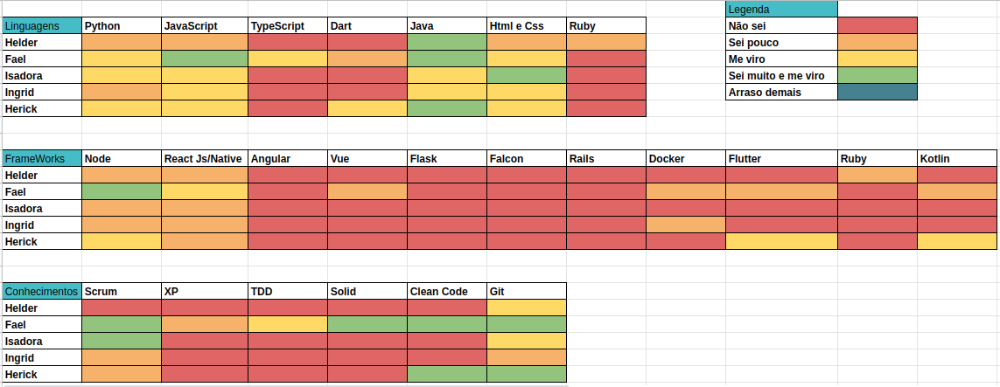
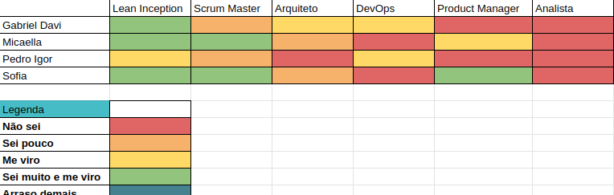
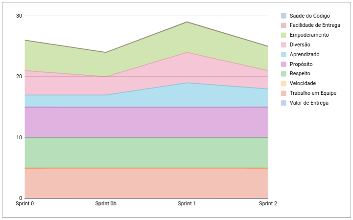
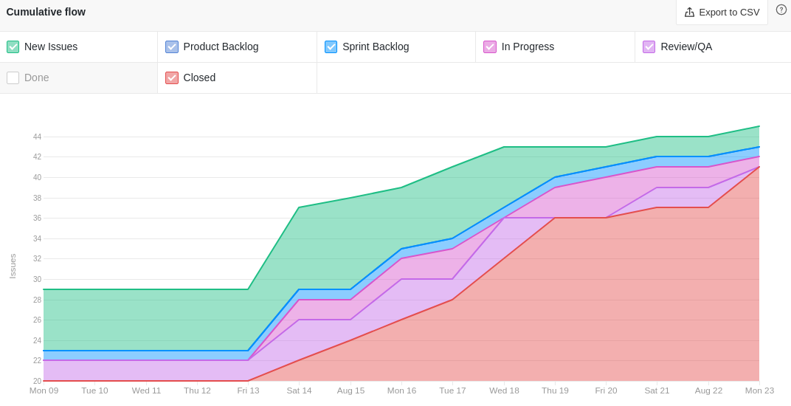
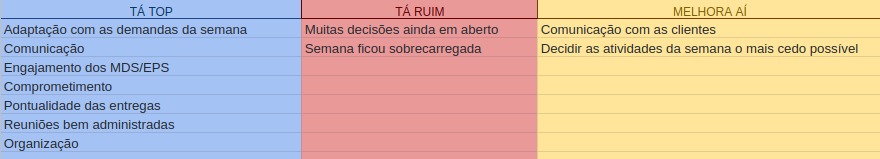
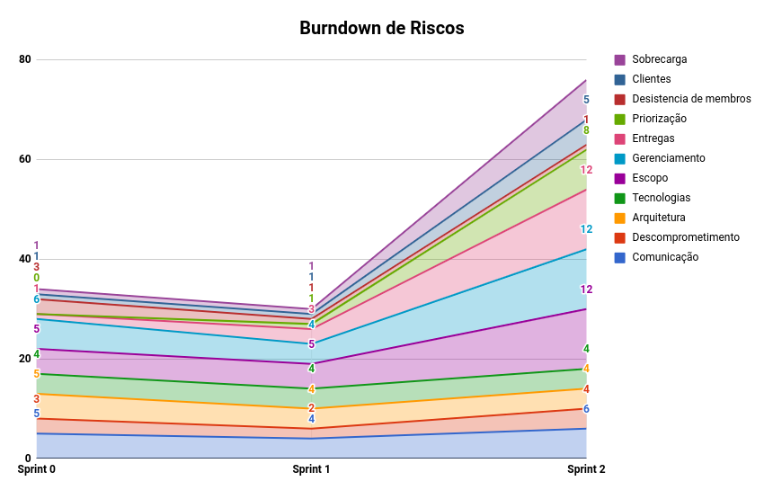

# Resultados Semana de Planejamento 2

**Período: 15/08/2021 a 21/08/2021** 
**Data da Reunião: 21/08/2021**

## Issues Entregues
| PR | Issue | Descrição | Participantes |
|----|-------|-----------|---------------|
| [**#45**](https://github.com/fga-eps-mds/2021.1-Linguas-Indigenas-Docs/pull/45) | [**#31**](https://github.com/fga-eps-mds/2021.1-Linguas-Indigenas-Docs/issues/31) | Apresentação MVP para PO | Todos |
| - | [**#33**](https://github.com/fga-eps-mds/2021.1-Linguas-Indigenas-Docs/issues/33) | Ideias de Nome para o aplicativo | Todos |
| [**#44**](https://github.com/fga-eps-mds/2021.1-Linguas-Indigenas-Docs/pull/44) | [**#43**](https://github.com/fga-eps-mds/2021.1-Linguas-Indigenas-Docs/issues/43) | Protótipo de Baixa Fidelidade | MDS |

## Issues Não Entregues
| PR | Issue | Descrição | Participantes |
|----|-------|-----------|---------------|
| - | [**#32**](https://github.com/fga-eps-mds/2021.1-Linguas-Indigenas-Docs/issues/32) | Questionário para Usuário | Todos |
| - | [**#34**](https://github.com/fga-eps-mds/2021.1-Linguas-Indigenas-Docs/issues/34) | Elicitação de Requisitos e Priorização | Todos |
| - | [**#35**](https://github.com/fga-eps-mds/2021.1-Linguas-Indigenas-Docs/issues/35) | Histórias de Usuário | Todos |

As issues não entregues foram para a sprint Backlog, pois não obtivemos a validação do MVP com as clientes.

## Quadro de Conhecimento (MDS)

## Quadro de Conhecimento (EPS)

## Burndown
*Como essa semana não foi pontuada, não há burndown.*

## Velocity
*Como essa semana não foi pontuada, não há velocity.*

## Health Check

## Cumulative Flow

## Retrospectiva

## Burndown de Riscos

* Nesta semana houve atrasos nas entregas.
* O grupo de EPS ficou um pouco perdido com o que deveria estar sendo feito.
* O time de clientes não conseguiu participar da reunião, atrasando um pouco nosso planejamento.

## Observações
- Nesta semana ocorreu a reunião para validação do MVP com as clientes, porém, devido a um congresso, muitas não puderam estar presentes, adiando a nossa validação para o dia 30/08. Com isso algumas entregas ficaram comprometidas.