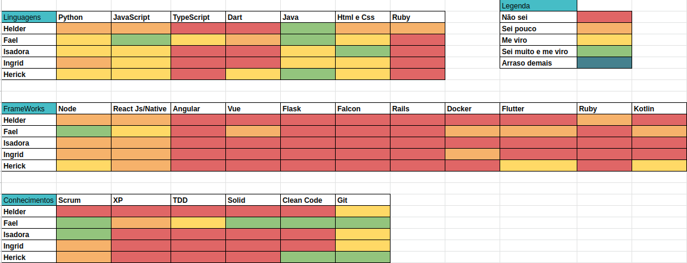
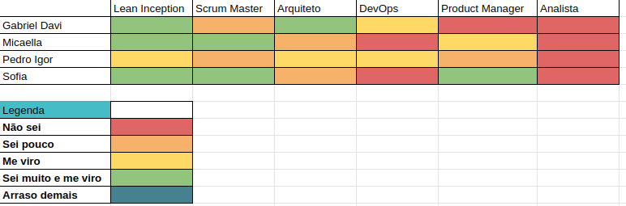
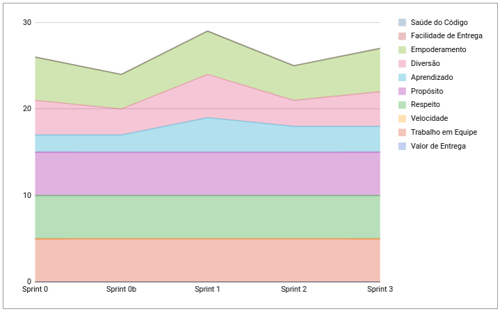
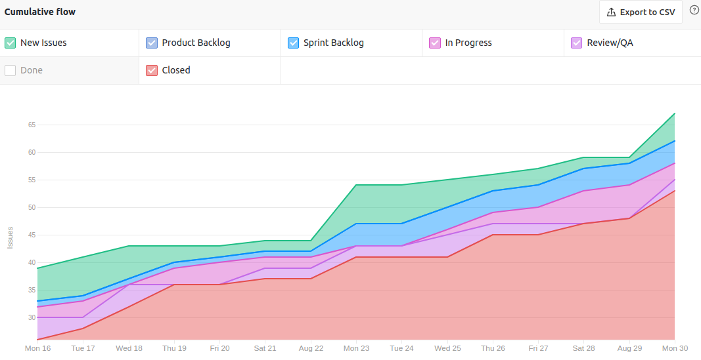
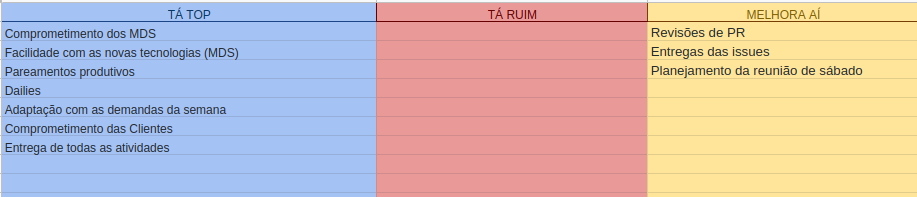
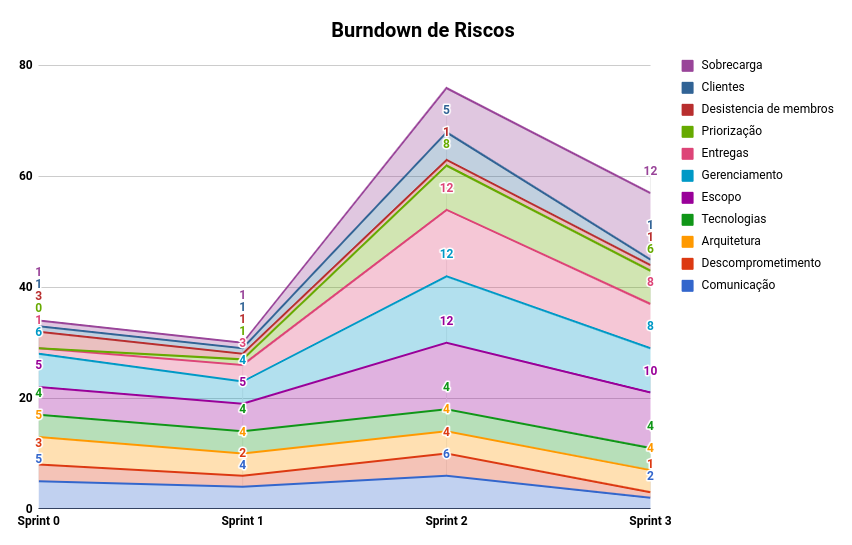

# Resultados Semana de Planejamento 3

**Período: 23/08/2021 a 29/08/2021** 
**Data da Reunião: 28/08/2021**

## Issues Entregues
| PR | Issue | Descrição | Participantes |
|----|-------|-----------|---------------|
| [**72**](https://github.com/fga-eps-mds/2021.1-Multilind-Docs/pull/72) | [**#47**](https://github.com/fga-eps-mds/2021.1-Linguas-Indigenas-Docs/issues/47) | Protótipo de Média Fidelidade | MDS |
| [**#58**](https://github.com/fga-eps-mds/2021.1-Linguas-Indigenas-Docs/pull/58) | [**#48**](https://github.com/fga-eps-mds/2021.1-Linguas-Indigenas-Docs/issues/48) | Representação Arquitetural | MDS |
| [**#62**](https://github.com/fga-eps-mds/2021.1-Linguas-Indigenas-Docs/pull/62) | [**#49**](https://github.com/fga-eps-mds/2021.1-Linguas-Indigenas-Docs/issues/49) | Visão Lógica do Projeto | Pedro Igor |
| [**#59**](https://github.com/fga-eps-mds/2021.1-Linguas-Indigenas-Docs/pull/59) | [**#50**](https://github.com/fga-eps-mds/2021.1-Linguas-Indigenas-Docs/issues/50) | Diagramas de Contexto | Gabriel Davi |
| [**#55**](https://github.com/fga-eps-mds/2021.1-Linguas-Indigenas-Docs/pull/55) | [**#51**](https://github.com/fga-eps-mds/2021.1-Linguas-Indigenas-Docs/issues/51) | Requisitos e Restrições de Arquitetural | Micaella Gouveia |
| [**#56**](https://github.com/fga-eps-mds/2021.1-Linguas-Indigenas-Docs/pull/56) | [**#52**](https://github.com/fga-eps-mds/2021.1-Linguas-Indigenas-Docs/issues/52) | Análise de Gantt | Sofia Patrocínio e Micaella Gouveia |
| [**#60**](https://github.com/fga-eps-mds/2021.1-Linguas-Indigenas-Docs/pull/53) | [**#60**](https://github.com/fga-eps-mds/2021.1-Linguas-Indigenas-Docs/issues/53) | Entrevistas Acampamento Luta pela Vida | Sofia Patrocínio |

## Quadro de Conhecimento (MDS)

## Quadro de Conhecimento (EPS)

## Burndown
*Como essa semana não foi pontuada, não há burndown.*

## Velocity
*Como essa semana não foi pontuada, não há velocity.*

## Health Check

## Cumulative Flow

## Retrospectiva

## Burndown de Riscos

* Ainda existem dúvidas sobre a viabilidade do escopo e sua priorização.

## Observações
- Nesta semana muitas entregas ficaram para última hora.