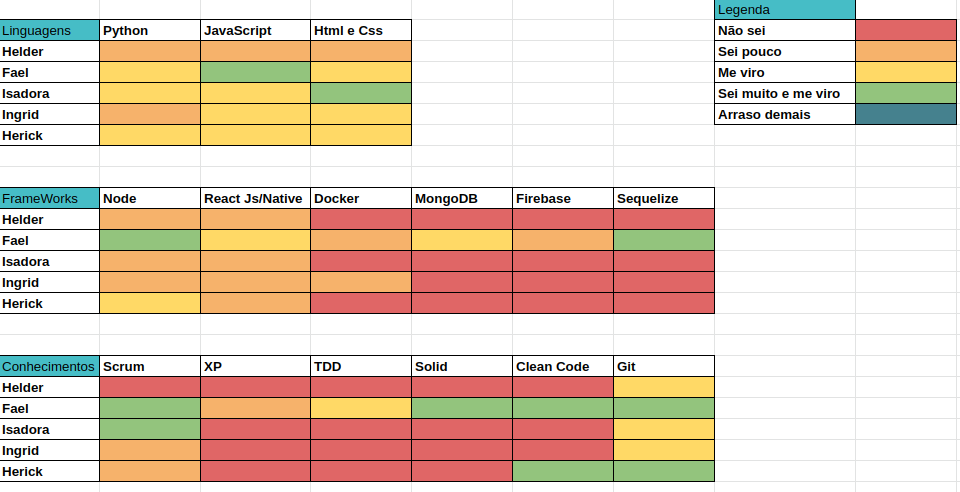
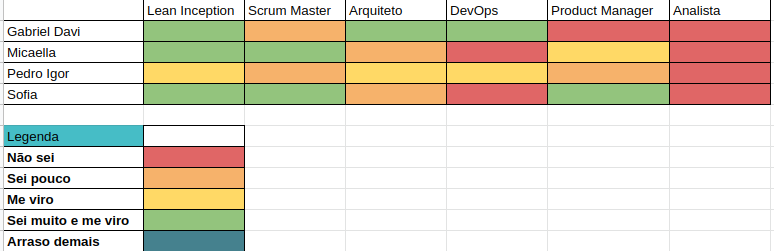
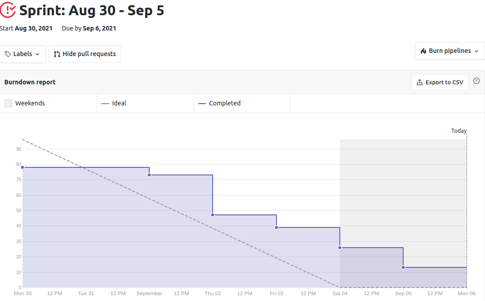
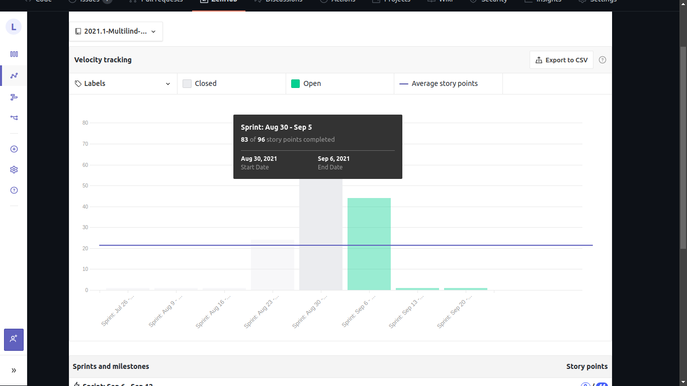
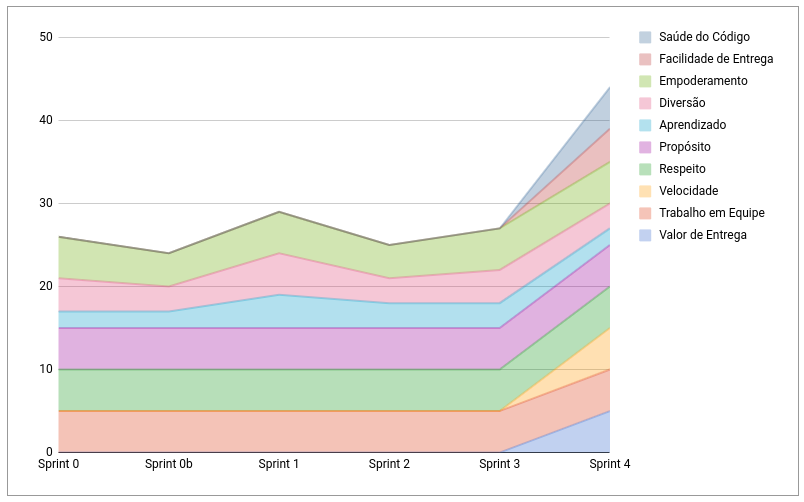
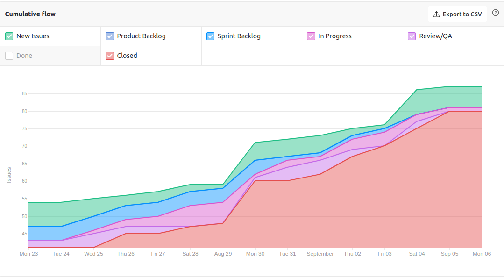

# Resultados Sprint 4

**Período: 30/08/2021 a 05/09/2021** 
**Data da Reunião: 04/09/2021**

## Issues Entregues
| PR | Issue | Descrição | Pontuação | Participantes |
|----|-------|-----------|-----------|---------------|
| [**70**](https://github.com/fga-eps-mds/2021.1-Multilind-Docs/pull/70) |[**#5**](https://github.com/fga-eps-mds/2021.1-Linguas-Indigenas-Docs/issues/5) | Como contribuir, licença, código de conduta | 3 | Pedro Igor |
| [**75**](https://github.com/fga-eps-mds/2021.1-Multilind-Docs/pull/75)|[**#34**](https://github.com/fga-eps-mds/2021.1-Linguas-Indigenas-Docs/issues/35) | Priorização | 5 | EPS |
| [**73**](https://github.com/fga-eps-mds/2021.1-Multilind-Docs/pull/73) e [**74**](https://github.com/fga-eps-mds/2021.1-Multilind-Docs/pull/74)|[**#35**](https://github.com/fga-eps-mds/2021.1-Linguas-Indigenas-Docs/issues/35) |Histórias de Usuário | 13 | MDS |
| [**86**](https://github.com/fga-eps-mds/2021.1-Multilind-Docs/pull/86)|[**#63**](https://github.com/fga-eps-mds/2021.1-Linguas-Indigenas-Docs/issues/63) | Manual de Identidade Visual | 5 | Sofia Patrocínio | Sofia Patrocínio |
| [**79**](https://github.com/fga-eps-mds/2021.1-Multilind-Docs/pull/79)|[**#65**](https://github.com/fga-eps-mds/2021.1-Linguas-Indigenas-Docs/issues/65) | Modelagem do Banco de Dados | 8 | Pedro Igor | Pedro Igor |
| - |[**#66**](https://github.com/fga-eps-mds/2021.1-Linguas-Indigenas-Docs/issues/66) | Criação dos Repositórios e Dockerização | 8 | Gabriel Davi | Gabriel Davi |
| [**69**](https://github.com/fga-eps-mds/2021.1-Multilind-Docs/pull/69) | [**#57**](https://github.com/fga-eps-mds/2021.1-Linguas-Indigenas-Docs/issues/57) | Análise de Riscos | 5 | EPS | Micaella Gouveia |

## Pontuação : 47

## Dívida Técnica : 13
| Número | Issue | Pontuação | Participantes | Responsável |
|--------|-------|-----------|---------------|-------------|
| [**#64**](https://github.com/fga-eps-mds/2021.1-Linguas-Indigenas-Docs/issues/64) | Protótipo de Alta Fidelidade | 8 | Sofia Patrocínio | Sofia Patrocínio |
| [**#67**](https://github.com/fga-eps-mds/2021.1-Indigenas-Docs/issues/67) | Análise de Custos | 5 | EPS (+ MDS) | EPS |

## Quadro de Conhecimento (MDS)

## Quadro de Conhecimento (EPS)

## Burndown

## Velocity

## Health Check

## Cumulative Flow

## Retrospectiva

## Observações
- Como as datas para cada issue foi pre definida, conseguimos entregar de forma evolutiva a maioria das issues, ficando de fora a Issue do Protótipo de Alta e de Análise de Riscos.
- Houve uma boa comunicação entre MDS e EPS durante a semana, gerando várias reuniões em conjunto.
- As dívidas técnicas já ficarão para a próxima semana, pois será a última antes da entrega da R1.