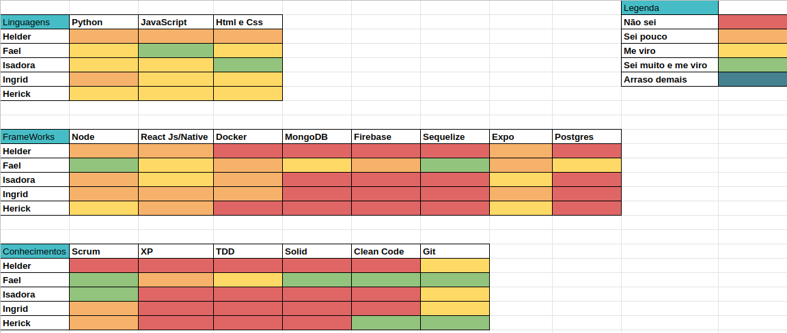
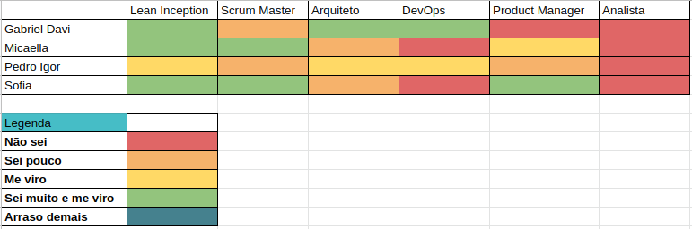
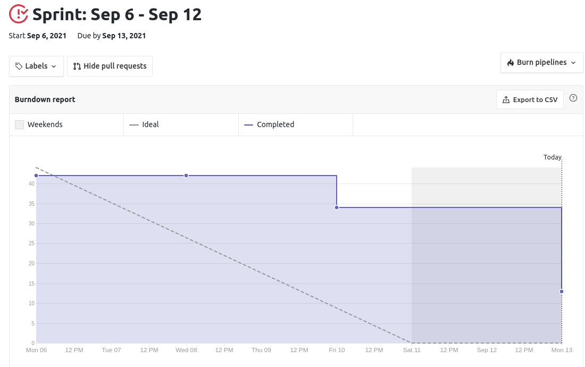
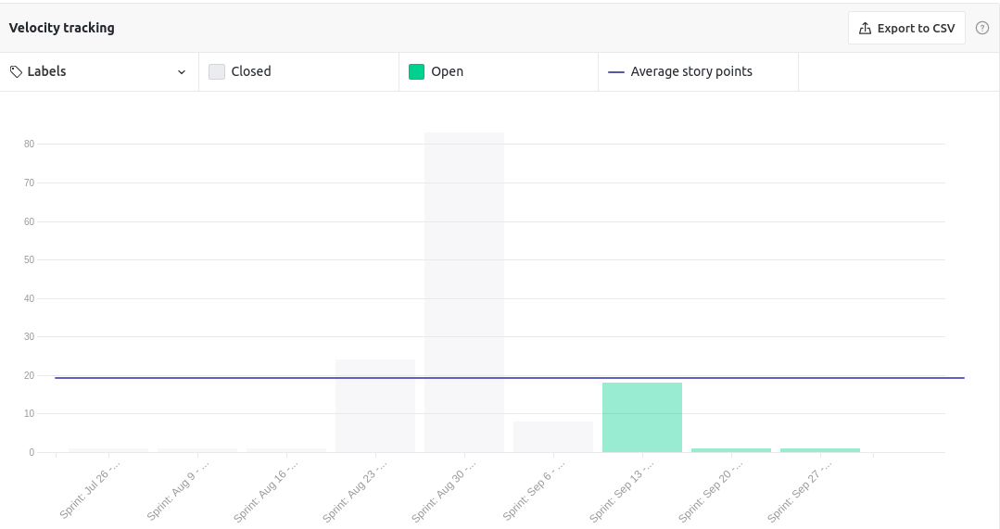
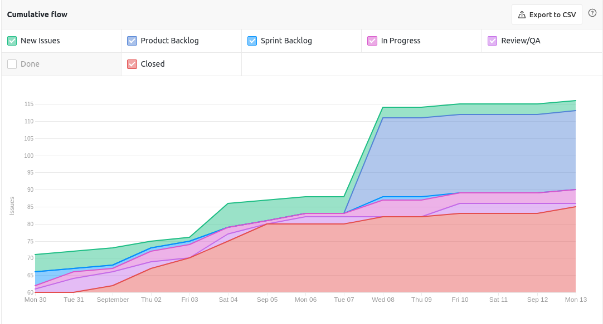
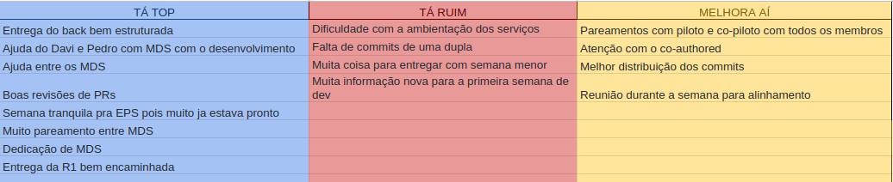

# Resultados Sprint 5

**Período: 06/09/2021 a 12/09/2021** 
**Data da Reunião: 11/09/2021**

## Issues Entregues
| PR | Issue | Descrição | Pontuação | Participantes |
|----|-------|-----------|-----------|---------------|
| [**70**](https://github.com/fga-eps-mds/2021.1-Multilind-Docs/pull/70) | [**#5**](https://github.com/fga-eps-mds/2021.1-Linguas-Indigenas-Docs/issues/5) | Como contribuir, licença, código de conduta | 3 | Pedro Igor |
| - | [**#81**](https://github.com/fga-eps-mds/2021.1-Linguas-Indigenas-Docs/issues/81) | Padrões de PR e como rodar projeto nos Microsserviços | 2 | Gabriel Davi |
| -|[**#82**](https://github.com/fga-eps-mds/2021.1-Linguas-Indigenas-Docs/issues/82) | Roadmap Github | 8 | Grupo EPS | Grupo EPS |
| [**119**](https://github.com/fga-eps-mds/2021.1-Multilind-Docs/pull/119) | [**#83**](https://github.com/fga-eps-mds/2021.1-Linguas-Indigenas-Docs/issues/83) | Atualização do Documento de Arquitetura | 5 | Pedro Igor |
| - |[**#84**](https://github.com/fga-eps-mds/2021.1-Linguas-Indigenas-Docs/issues/84) | US24 Localização no Mapa (Parte 1) | 8 | Grupo MDS ( + Gabriel Davi) | Isadora e Ingrid ( + Gabriel Davi) |
| [**Content #1**](https://github.com/fga-eps-mds/2021.1-Multilind-content-server/pull/1) [**Content #2**](https://github.com/fga-eps-mds/2021.1-Multilind-content-server/pull/2)| [**#85**](https://github.com/fga-eps-mds/2021.1-Linguas-Indigenas-Docs/issues/82) | US11 Cadastro de Etnia (Parte 1) | 8 | Grupo MDS | Carlos Rafael, Helder e Hérick |

## Pontuação : 26

## Dívida Técnica : 13
| Número | Issue | Pontuação | Participantes | Responsável |
|--------|-------|-----------|---------------|-------------|
| [**#64**](https://github.com/fga-eps-mds/2021.1-Linguas-Indigenas-Docs/issues/64) | Protótipo de Alta Fidelidade | 8 | Sofia Patrocínio e Micaella Gouveia | Sofia Patrocínio e Micaella Gouveia |
| [**#67**](https://github.com/fga-eps-mds/2021.1-Indigenas-Docs/issues/67) | Análise de Custos | 5 | EPS (+ MDS) | EPS |

## Quadro de Conhecimento (MDS)

## Quadro de Conhecimento (EPS)

## Burndown

## Velocity

## Health Check

## Cumulative Flow

## Retrospectiva

## Observações
- Essa foi a primeira Sprint de desenvolvimento de MDS. Houve dificuldades com o pareamento pela discrepância de conhecimento entre os membros, pois houve uma dificuldade de aplicar o piloto e co-piloto. O grupo de EPS conversou com o grupo para que isso não se repita.
- O time que pareou com o EPS Gabriel Davi aprendeu bastante sofre o front e a biblioteca de mapas. Mas houve um problema para emular o aplicativo, sendo feita no computador do Gabriel, mas para as próximas semanas será utilizado o Expo.
- O protótipo de alta fidelidade e a análise de custos serão entregues até segunda antes da entrega da R1.
- Alguns dados do velocity ficaram incoerentes pois não houve o fechamento manual das issues de desenvolvimento em outros repositórios dos microsserviços no repositório de documentação.