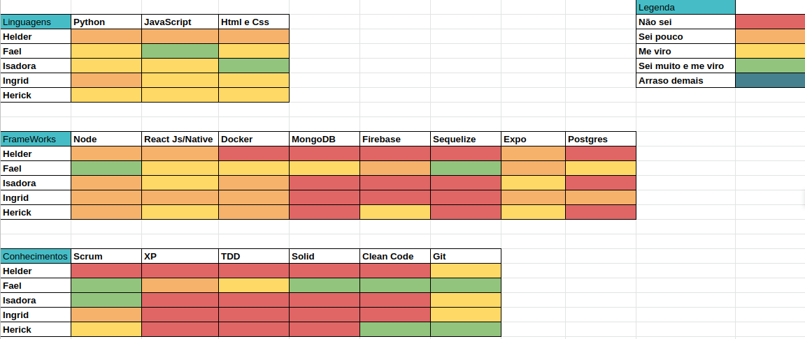
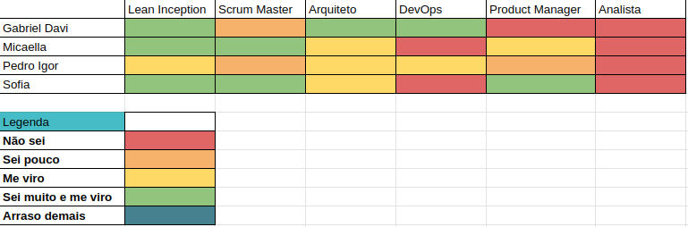
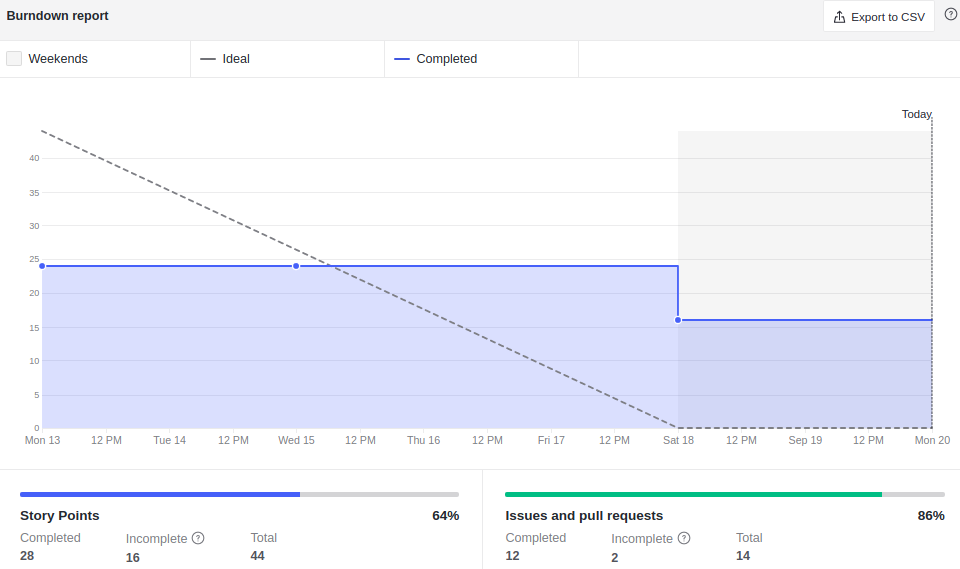
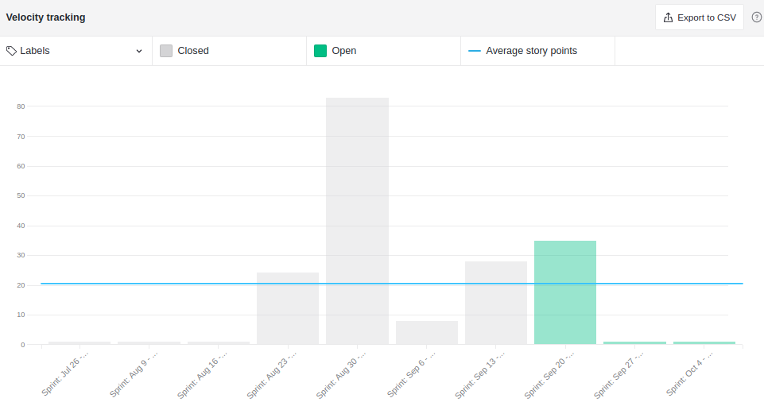
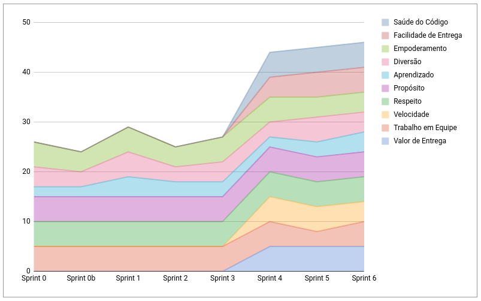
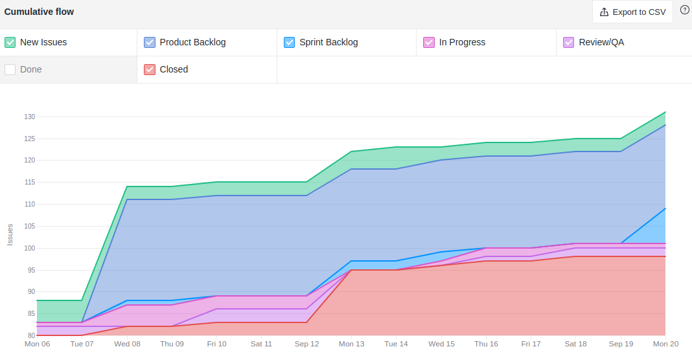
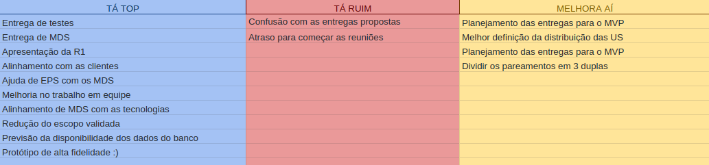
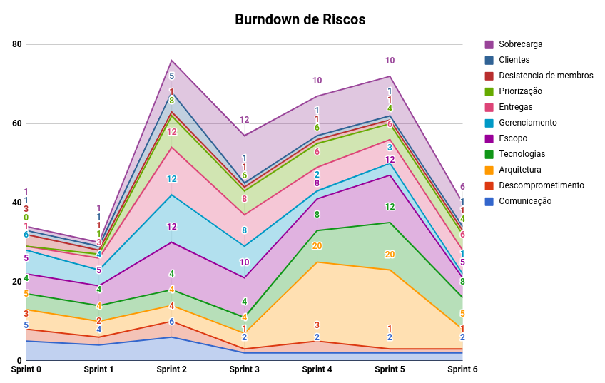

# Resultados Sprint 2

**Período: 13/09/2021 a 19/09/2021** 
**Data da Reunião: 18/09/2021**
## Issues Entregues
| PR | Issue | Descrição | Pontuação | Participantes |
|----|-------|-----------|-----------|---------------|
| [**126**](https://github.com/fga-eps-mds/2021.1-Multilind-Docs/pull/126) | [**#67**](https://github.com/fga-eps-mds/2021.1-Indigenas-Docs/issues/67) | Análise de Custos | Sem | EPS (+ MDS) |
| [**124**](https://github.com/fga-eps-mds/2021.1-Multilind-Docs/pull/124) | [**#64**](https://github.com/fga-eps-mds/2021.1-Linguas-Indigenas-Docs/issues/64) | Protótipo de Alta Fidelidade | Sem | Sofia Patrocínio e Micaella |
| [**123**](https://github.com/fga-eps-mds/2021.1-Multilind-Docs/pull/123) | [**#121**](https://github.com/fga-eps-mds/2021.1-Linguas-Indigenas-Docs/issues/121) | Documentação do Backlog | Sem | EPS |
| - | [**#122**](https://github.com/fga-eps-mds/2021.1-Linguas-Indigenas-Docs/issues/122) | Apresentação da Release 1 | Sem | EPS + MDS |

## Pontuação : 0
## Dívida Técnica : 16
| Número | Issue | Pontuação | Participantes | Responsável |
|--------|-------|-----------|---------------|-------------|
| [**#99**](https://github.com/fga-eps-mds/2021.1-Multilind-Docs/issues/99) | US12 Associação de palavras | 8 | MDS | Carlos Rafael, Herick e Ingrid |
| [**#100**](https://github.com/fga-eps-mds/2021.1-Multilind-Docs/issues/100) | US13 Listagem de línguas | 8 | MDS | Helder e Isadora |

## Quadro de Conhecimento (MDS)

## Quadro de Conhecimento (EPS)

## Burndown

## Velocity

## Health Check

## Cumulative Flow

## Retrospectiva

## Burndown de Riscos

* Foi uma sprint apertada na segunda feira com a entrega da release 1, mas depois ficou mais tranquilo, sendo focada na apresentação
* Clientes concordaram com o corte do escopo, ficando mais fácil o planejamento do novo MVP e entrega final

## Observações
- Essa foi a Sprint de entrega da Release 1, tendo muitas entregas na segunda feira dia da entrega, e a preparação da apresentação para as clientes na sexta feira.
