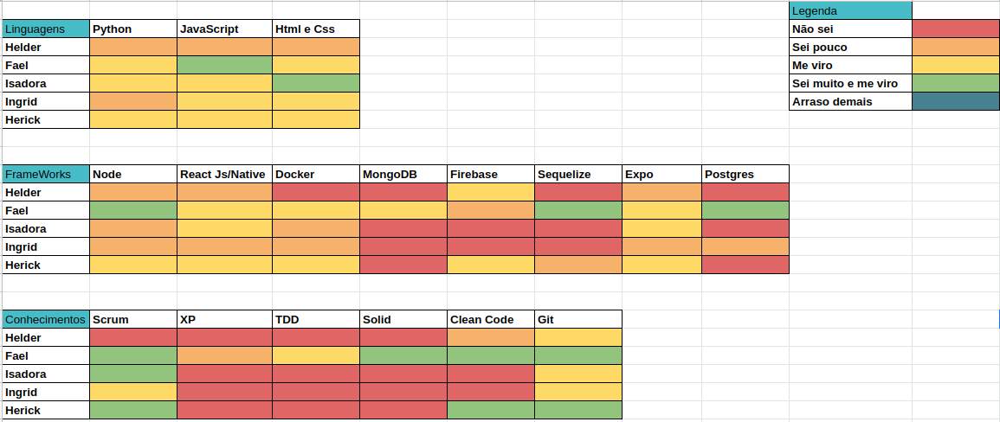
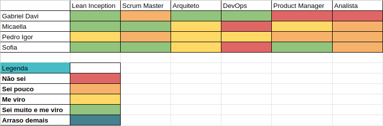
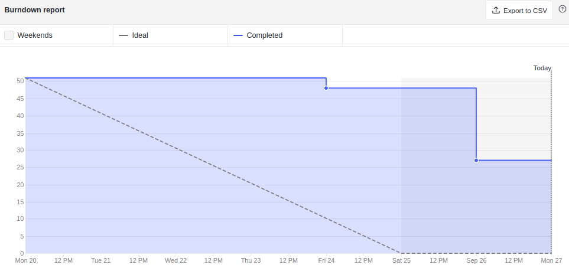
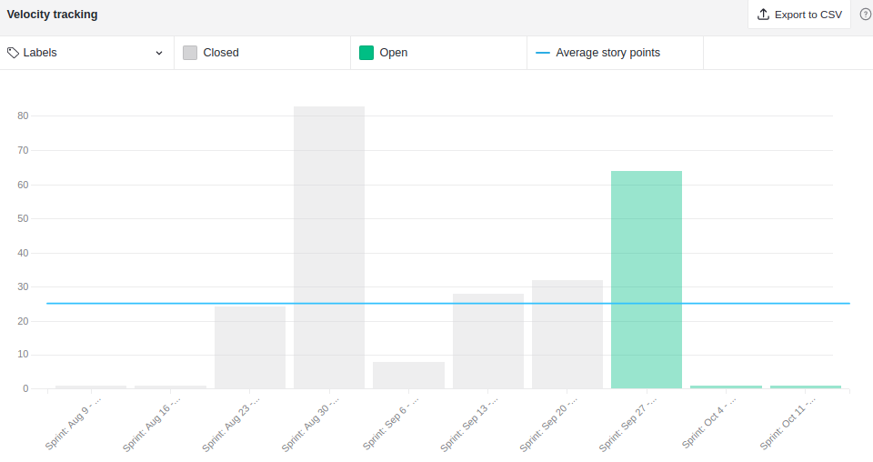
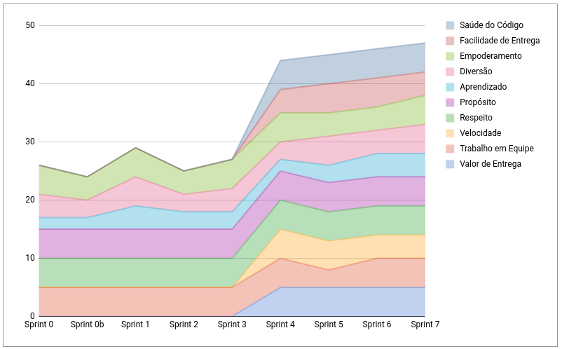
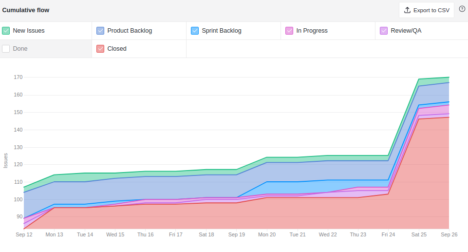
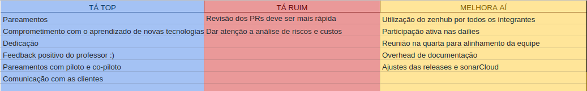
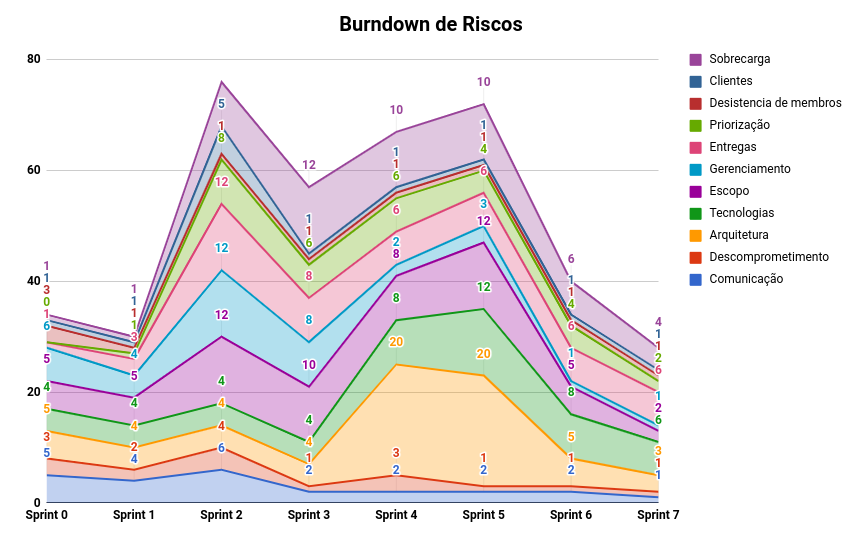

# Resultados Sprint 7

**Período: 20/09/2021 a 26/09/2021** 
**Data da Reunião: 25/09/2021**

## Issues Entregues
| PR | Issue | Descrição | Pontuação | Participantes |
|----|-------|-----------|-----------|---------------|
| [**Content #4**](https://github.com/fga-eps-mds/2021.1-Multilind-content-server/pull/4/) | [**#99**](https://github.com/fga-eps-mds/2021.1-Multilind-Docs/issues/99) | US12 Associação de palavras | 8 | MDS |
| [**Mobile #7**](https://github.com/fga-eps-mds/2021.1-Multilind-Mobile-App/pull/7) | [**#100**](https://github.com/fga-eps-mds/2021.1-Multilind-Docs/issues/100) | US13 Listagem de línguas Parte 1 | 8 | MDS |
| [**Mobile #8**](https://github.com/fga-eps-mds/2021.1-Multilind-Mobile-App/pull/8) |[**#100**](https://github.com/fga-eps-mds/2021.1-Multilind-Docs/issues/100) | US13 Listagem de línguas Parte 2| 3 | MDS |
| [**Files #4**](https://github.com/fga-eps-mds/2021.1-Multilind-files-server/pull/4)|[**#130**](https://github.com/fga-eps-mds/2021.1-Multilind-Docs/issues/130) | Configuração Inicial do Banco Storage Firebase | 8 | MDS (+ EPS) |
| - |[**#131**](https://github.com/fga-eps-mds/2021.1-Multilind-Docs/issues/131) | Deploy contínuo dos microsserviços | 5 | EPS|
| [**Docs #137**](https://github.com/fga-eps-mds/2021.1-Multilind-Docs/pull/137)|[**#135**](https://github.com/fga-eps-mds/2021.1-Multilind-Docs/issues/135) | Atualizações de Escopo | 3 | EPS |

## Pontuação : 19 + 16 (Dívidas Técnicas)
## Dívida Técnica : 22
| Número | Issue | Pontuação | Participantes | Responsável |
|--------|-------|-----------|---------------|-------------|
| [**#101**](https://github.com/fga-eps-mds/2021.1-Multilind-Docs/issues/101) | US14 Listagem de línguas por troncos linguísticos | 8 | MDS | Carlos Rafael e Isadora |
| [**#104**](https://github.com/fga-eps-mds/2021.1-Multilind-Docs/issues/104) | US17 Listagem de palavras por línguas | 8 | MDS | Hérick e Ingrid |
| [**#132**](https://github.com/fga-eps-mds/2021.1-Multilind-Docs/issues/132) | Ajustar coleta de métricas do SonarCloud | 3 | EPS | Gabriel Davi |
|[**#133**](https://github.com/fga-eps-mds/2021.1-Multilind-Docs/issues/133) | Canvas PBB | 3 | EPS | Sofia Patrocínio |

## Quadro de Conhecimento (MDS)

## Quadro de Conhecimento (EPS)

## Burndown

## Velocity

## Health Check

## Cumulative Flow

*Houve uma discrepância no cumulative Flow pois os outros repositórios dos microsserviços foram adicionados ao ambiente do Zenhub.*

## Retrospectiva

## Burndown de Riscos

* Semana com muitas entregas, mas a comunicçação ajudou a entender como o planejamento pro MVP vai funcionar
* Equipe trabalhou muito bem com os pareamentos
* Com o escopo reduzido, o planejamento ficou mais viável

## Observações
* Nesta Sprint tivemos um feedback do professor Hilmer. Ele em geral foi muito positivo, dando ao time um novo gás para continuar o projeto.
* Algumas pontuações foram feitas pelo professor, que teremos que nos atentar, como:
  * Fazer o monitoramento dos riscos e custos do projeto semanalmente
  * Atentar-se ao overhead de documentação
  * Tornar backlog interativo
  * Organizar o roadmap com as datas previstas para cada épico
  * Determinar dia das releases
  * Fazer a coleta do sonarCloud de forma automática
  * Geração de tags pelas pipelines de cada serviço
  * Adiconar os microsserviços no Zenhub
* A issue [**#134**](https://github.com/fga-eps-mds/2021.1-Multilind-Docs/issues/134) ficará em backlog devido às alterações que deverão ser feitas que são mais críticas no momento.