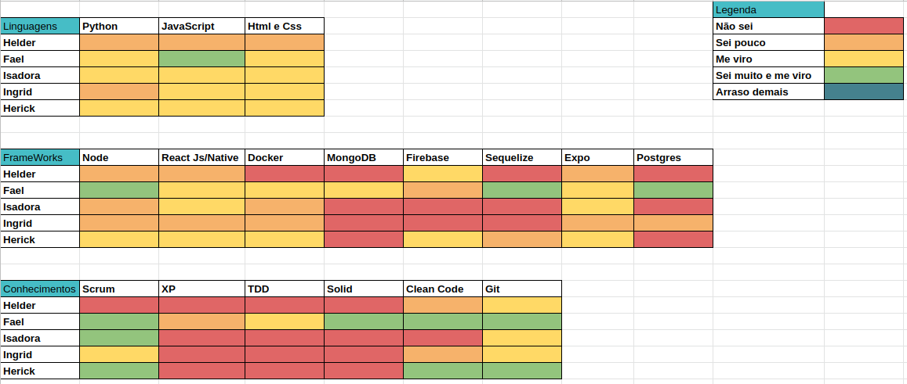
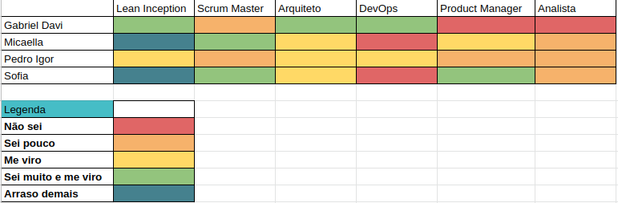
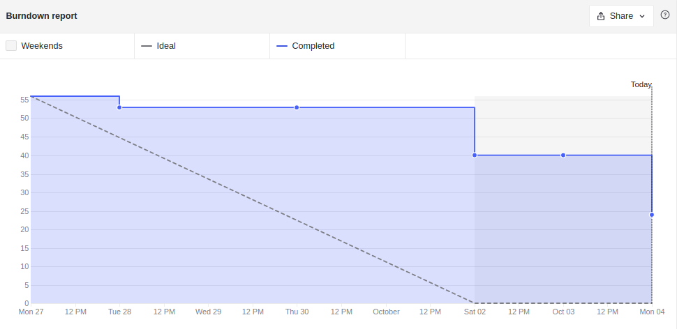
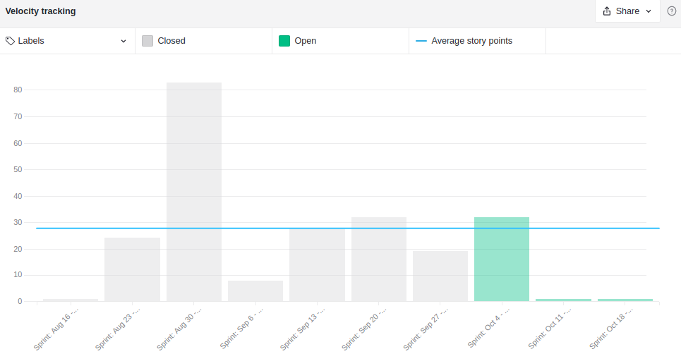
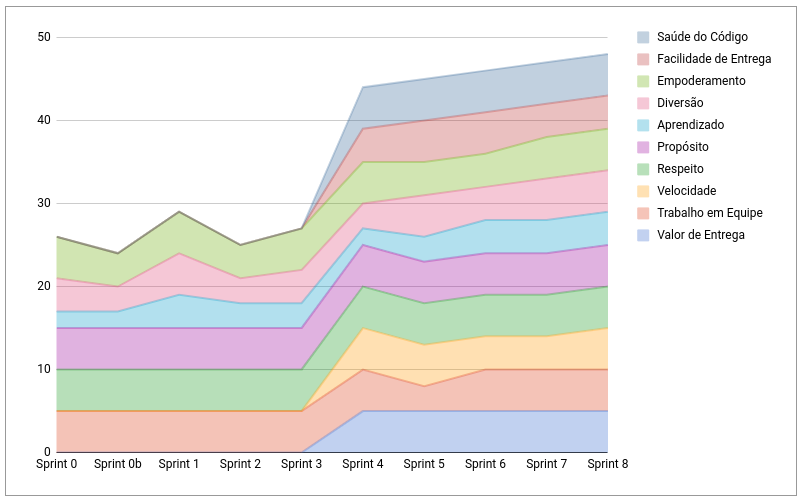
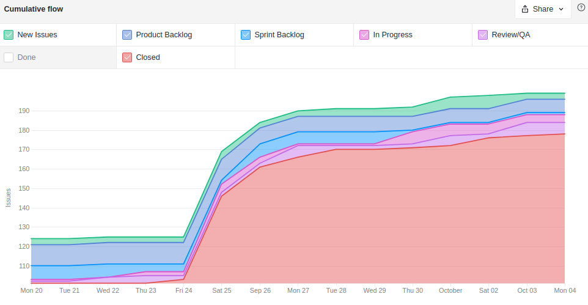
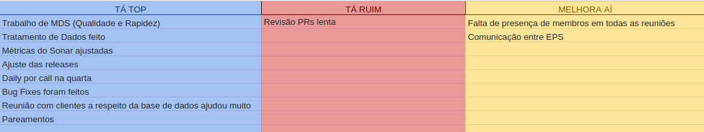
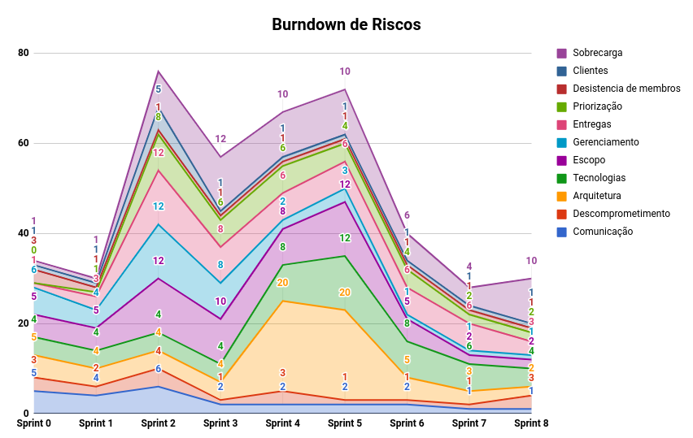

# Resultados Sprint 4

**Período: 20/09/2021 a 26/09/2021** 
**Data da Reunião: 25/09/2021**

## Issues Entregues
| PR | Issue | Descrição | Pontuação | Participantes |
|----|-------|-----------|-----------|---------------|
| [**Content #14**](https://github.com/fga-eps-mds/2021.1-Multilind-content-server/pull/14) [**Mobile #11**](https://github.com/fga-eps-mds/2021.1-Multilind-Mobile-App/pull/11) | [**#101**](https://github.com/fga-eps-mds/2021.1-Multilind-Docs/issues/101) | US14 Listagem de línguas por troncos linguísticos | 8 | MDS |
| - | [**#132**](https://github.com/fga-eps-mds/2021.1-Multilind-Docs/issues/132) | Ajustar coleta de métricas do SonarCloud | Sem | EPS |
| [**Docs #143**](https://github.com/fga-eps-mds/2021.1-Multilind-Docs/pull/143) | [**#133**](https://github.com/fga-eps-mds/2021.1-Multilind-Docs/issues/133) | Canvas PBB | Sem | EPS |
| [**Content #17**](https://github.com/fga-eps-mds/2021.1-Multilind-content-server/pull/17) | [**#139**](https://github.com/fga-eps-mds/2021.1-Multilind-Docs/issues/139) | Tratamento de Dados | Sem | EPS |
| - | [**#140**](https://github.com/fga-eps-mds/2021.1-Multilind-Docs/issues/140) | **BUFGIX** - Arrumar datas do RoadMap | Sem | EPS |
| [**Docs #144**](https://github.com/fga-eps-mds/2021.1-Multilind-Docs/pull/144) | [**#141**](https://github.com/fga-eps-mds/2021.1-Multilind-Docs/issues/140) | **BUFGIX** - Atualização protótipo e conserto backlog | Sem | EPS |
| [**Mobile #13**](https://github.com/fga-eps-mds/2021.1-Multilind-Mobile-App/pull/13) | [**#105**](https://github.com/fga-eps-mds/2021.1-Multilind-Docs/issues/105) | US18 Apresentação de imagens por palavras | 8 | MDS |

## Pontuação : 16
## Dívida Técnica : 24
| Número | Issue | Pontuação | Participantes | Responsável |
|--------|-------|-----------|---------------|-------------|
| [**#103**](https://github.com/fga-eps-mds/2021.1-Multilind-Docs/issues/103) | US16 Listagem de etnias por língua | 8 | MDS | Hérick e Ingrid |
| [**#104**](https://github.com/fga-eps-mds/2021.1-Multilind-Docs/issues/104) | US17 Listagem de palavras por línguas | 8 | MDS | Hérick e Ingrid |
| [**#111**](https://github.com/fga-eps-mds/2021.1-Multilind-Docs/issues/111) | US25 Localização do usúario - MAPA | 8 | MDS (+ EPS) | Helder + Gabriel Davi |

## Quadro de Conhecimento (MDS)

## Quadro de Conhecimento (EPS)

## Burndown

## Velocity

## Health Check

## Cumulative Flow

*Houve uma discrepância no cumulative Flow pois os outros repositórios dos microsserviços foram adicionados ao ambiente do Zenhub.*

## Retrospectiva

## Burndown de Riscos

* Esta semana universitária, alguns membros se sentiram muito cansados
* Reunião com cliente para debater o tratamento de dados foi super produtiva
* Equipe trabalhou muito bem com os pareamentos
* Com o escopo reduzido, o planejamento ficou mais viável

## Observações
* Nesta Sprint tivemos uma reunião com as clientes e conhecemos o Thiago, linguista que conseguiu nos orientar sobre a coleta dos dados.
* Conseguimos fazer muitos ajustes que foram solicitados pelo professor, porém ainda não conseguimos ajustar o EVM, tarefa que terá prioridade máxima na próxima Sprint.