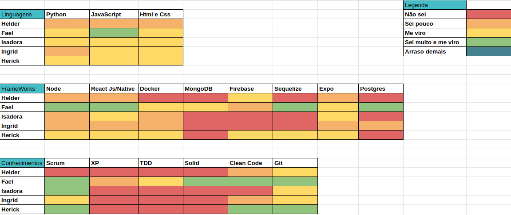
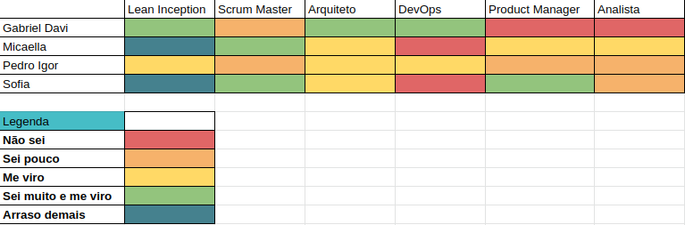
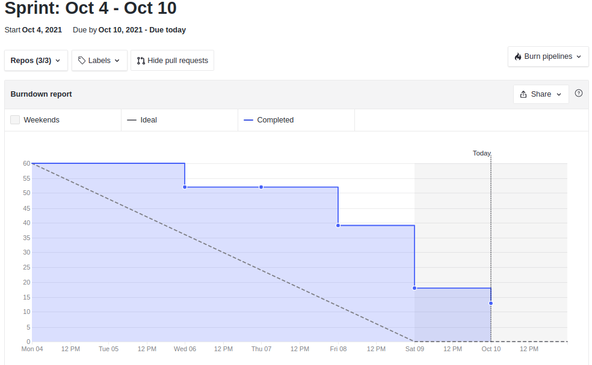
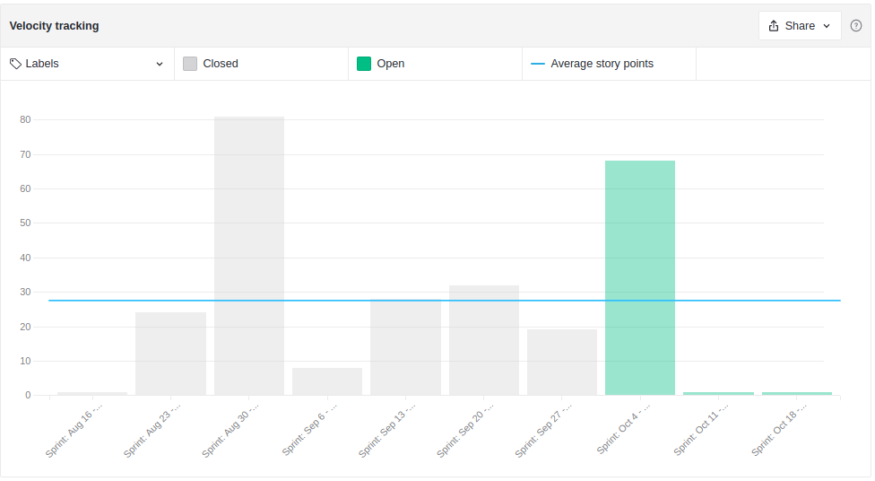
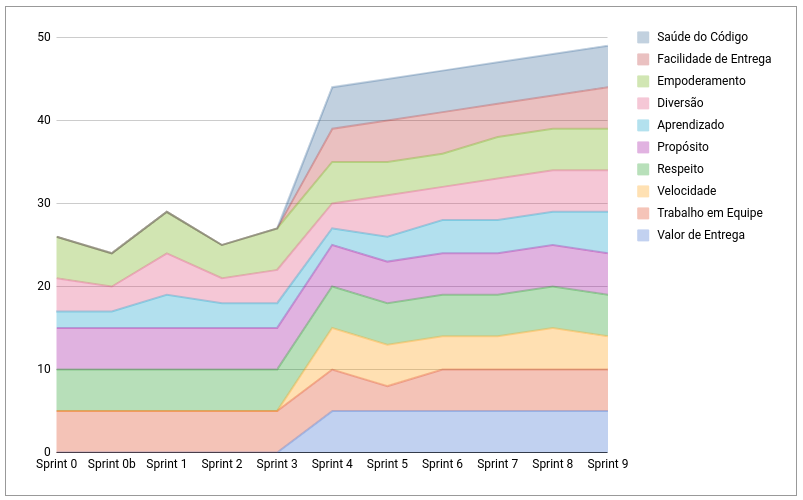
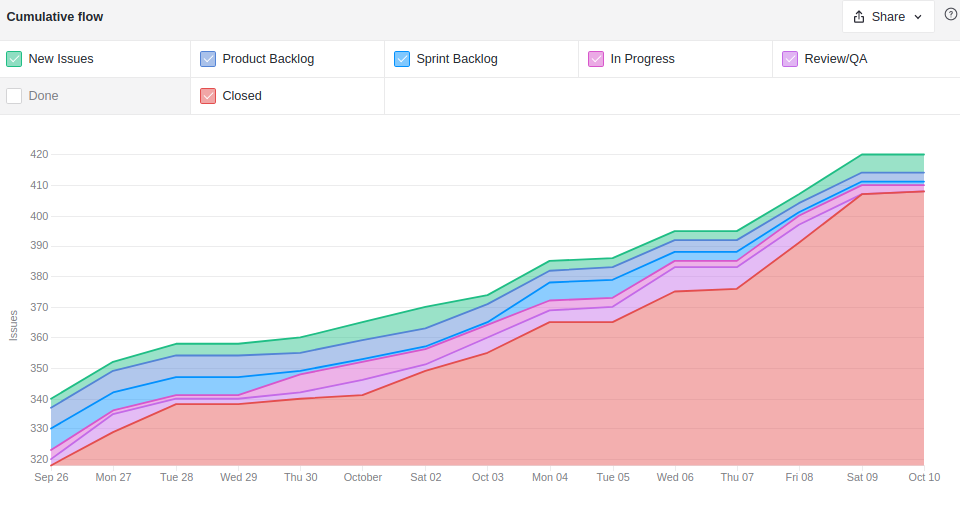
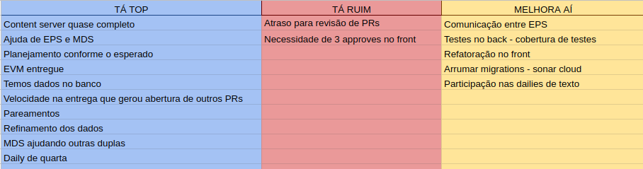
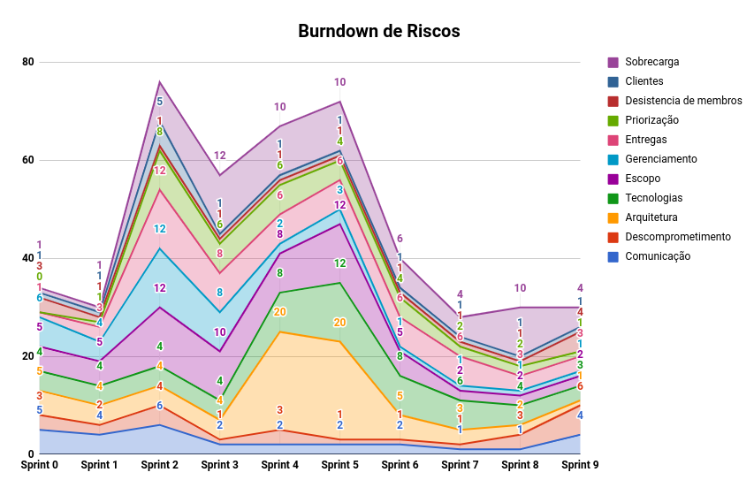

# Resultados Sprint 9

**Período: 04/10/2021 a 10/10/2021** 
**Data da Reunião: 09/10/2021**

## Issues Entregues Dívidas Técnicas
| PR | Issue | Descrição | Pontuação | Participantes | - |
|----|-------|-----------|-----------|---------------|--|
| [**Mobile #12**](https://github.com/fga-eps-mds/2021.1-Multilind-Mobile-App/pull/12) | [**#104**](https://github.com/fga-eps-mds/2021.1-Multilind-Docs/issues/104) | US17 Listagem de palavras por línguas | 8 | MDS | Hérick e Ingrid |
| [**Mobile #16**](https://github.com/fga-eps-mds/2021.1-Multilind-Mobile-App/pull/12) | [**#103**](https://github.com/fga-eps-mds/2021.1-Multilind-Docs/issues/103) | US16 Listagem de etnias por língua | 8 | MDS | Hérick e Ingrid |

## Issues Entregues
| PR | Issue | Descrição | Pontuação | Participantes | - |
|----|-------|-----------|-----------|---------------|--|
| [**Mobile #14**](https://github.com/fga-eps-mds/2021.1-Multilind-Mobile-App/pull/14) | [**#107**](https://github.com/fga-eps-mds/2021.1-Multilind-Docs/issues/107) | US20 Busca por língua | 8 | MDS | Carlos Rafael e Isadora |
| [**Mobile #15**](https://github.com/fga-eps-mds/2021.1-Multilind-Mobile-App/pull/15) | [**#108**](https://github.com/fga-eps-mds/2021.1-Multilind-Docs/issues/108) | US21 Busca por Tronco | 5 | MDS | Carlos Rafael e Isadora |
| [**Docs #151**](https://github.com/fga-eps-mds/2021.1-Multilind-Docs/pull/151) | [**#147**](https://github.com/fga-eps-mds/2021.1-Multilind-Docs/issues/147) | EVM | Sem | EPS | Micaella Gouveia |
| [**Content #22**](https://github.com/fga-eps-mds/2021.1-Multilind-content-server/pull/22) | [**#148**](https://github.com/fga-eps-mds/2021.1-Multilind-Docs/issues/148) | Refinamento dos Dados | Sem | EPS | Pedro Igor |
| - |[**#149**](https://github.com/fga-eps-mds/2021.1-Multilind-Docs/issues/149) | Protótipo da Página Web (Usuários Adm) | Sem | EPS | Sofia Patrocínio | - |

## Pontuação : 13 + 16 (Dívidas Técnicas)
## Dívida Técnica : 13
| Número | Issue | Pontuação | Participantes | Responsável |
|--------|-------|-----------|---------------|-------------|
| [**#111**](https://github.com/fga-eps-mds/2021.1-Multilind-Docs/issues/111) | US25 Localização do usúario - MAPA | 8 | MDS (+ EPS) | Helder + Gabriel Davi |
| [**#89**](https://github.com/fga-eps-mds/2021.1-Multilind-Docs/issues/89) | US01 Cadastro Usuário Administrador | 5 | EPS | Gabriel Davi |

## Quadro de Conhecimento (MDS)

## Quadro de Conhecimento (EPS)

## Burndown

## Velocity

## Health Check

## Cumulative Flow

## Retrospectiva

## Burndown de Riscos

* Tivemos algumas falhas de comunicação entre EPS, que comprometeram algumas entregas.
* Equipe trabalhou muito bem com os pareamentos
* Com o escopo reduzido, o planejamento ficou mais viável

## Observações
* Esta Sprint foi a última para a entrega do MVP, muitas US que estavam como dívidas técnicas foram fechadas.
* Issues de refatoração vão ser necessárias para aumentar a cobertura de testes e melhorar a qualidade no sonar cloud.
